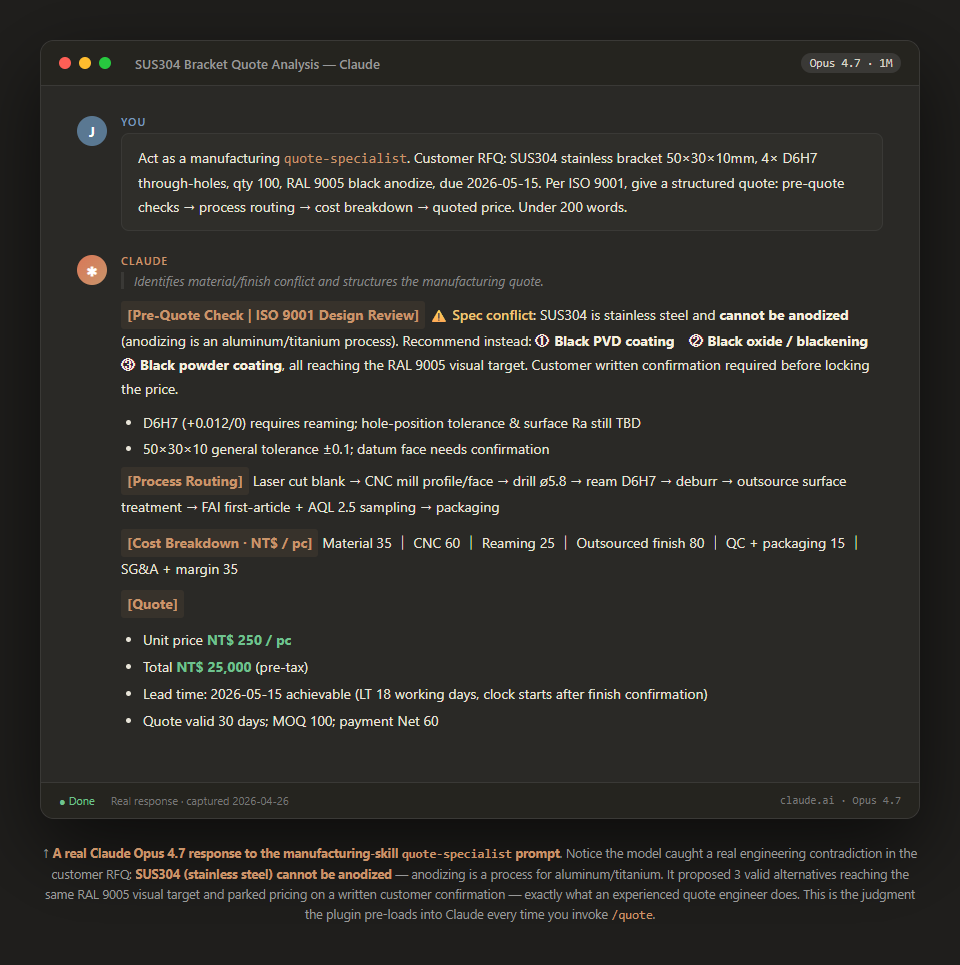

# manufacturing-skill

> AI starter kit for manufacturers — fork it, profile it, ship it.

[](https://github.com/jason-simhope-ai/manufacturing-skill/actions/workflows/ci.yml)
[](LICENSE)
[](https://claude.com/claude-code)
[](README.zh-TW.md)

A Claude Code plugin that gives any manufacturing company a 30-minute path to a working AI assistant — tailored to their vertical, runnable on their own GPU.

> 中文讀者請看 [README.zh-TW.md](README.zh-TW.md)

---

## ⭐ Live demo (real Claude Opus 4.7 acting as the `quote-specialist` persona)



**The catch this demo highlights:** the customer RFQ asks for "RAL9005 black anodize on SUS304 stainless steel" — which is metallurgically impossible (anodizing is for aluminum/titanium). Loaded as the `quote-specialist` persona, Claude flagged the conflict, proposed three valid alternatives (PVD coating / blackening / powder coat), and parked the price on a written customer confirmation — exactly what an experienced quote engineer does.

> Want the full transcript or an interactive playable mock?
>
> - Plain-text capture: [docs/demo/real-claude-response.md](docs/demo/real-claude-response.md)
> - Auto-playing browser animation: serve `docs/demo/` (`python -m http.server 8080`) and open [quote-demo.html](docs/demo/quote-demo.html)

---

## What this is

`manufacturing-skill` is a **Claude Code plugin** built around a **core + profile overlay** architecture for manufacturing AI adoption.

- **Core layer** — universal manufacturing primitives that apply to _any_ factory: 6-stage flow (quote → order → schedule → produce → inspect → ship), 5 agent personas (quote specialist, sales coordinator, production planner, quality inspector, inventory manager), and a baseline know-how library (ISO 9001, Lean, OEE, MRP).
- **Profile layer** — vertical-specific overlays. v1 ships a complete **CNC machining** profile (4 specialist agents, 3 skills, 4 know-how docs covering IATF 16949, tool life, cutting parameters, job-shop vs. mass production). Stub profiles for PCB assembly, injection molding, food processing, and pharma are scaffolded for community / customer contribution.
- **Infra layer** — MCP server templates for ERP/MES connectivity, on-prem LLM setup guides (Ollama on NVIDIA GB10), and reference configurations.
- **Adapter layer** — a Claude Code adapter (v1). Cursor / Gemini / Codex adapters are post-v1.

---

## Why this exists

Manufacturing AI adoption usually fails on three things:

| Problem                    | Traditional answer                                             | What this plugin gives you                                                           |
| -------------------------- | -------------------------------------------------------------- | ------------------------------------------------------------------------------------ |
| AI doesn't speak factory   | Train your own LLM, write all the prompts yourself             | 5 built-in agent personas + 4 know-how docs — AI understands ISO/Lean/OEE on day one |
| Every factory is different | Hire an SI, pay for full custom build                          | Core + profile overlay — fork, edit your profile, done                               |
| IT blocks cloud SaaS       | Cannot pass customer audits (drawings must not leave premises) | On-prem-first design with GB10/Ollama runtime                                        |

---

## Quick start

```bash
# 1. Clone
git clone https://github.com/jason-simhope-ai/manufacturing-skill.git
cd manufacturing-skill

# 2. Install into Claude Code (interactive profile picker)
bash adapters/claude-code/install.sh

# 3. In Claude Code, run:
/manufacturing init     # 4-question wizard for first-time users
```

Or skip the wizard:

```bash
/quote @examples/sample-drawing/bracket.md          # CNC profile demo
/quote "Stainless brackets, 100 pcs, ±0.05mm"      # plain text works too
```

---

### Not a CNC shop?

Three paths:

1. **Try without a profile (fastest)** — `bash install.sh --core-only`. Skips all vertical profiles and installs only the 5 universal agents (quote / sales / production / quality / inventory). Useful to evaluate "does this AI understand my factory at all" before committing.
2. **Use a stub + customize** — PCB / injection / food / pharma stubs ship with starter templates ready to fill in.
3. **Fork the CNC profile** — CNC is the most complete reference; fork and adapt is the fastest path. See [docs/profile-development.md](docs/profile-development.md).

---

### Cloud first, on-prem later

By default this needs **no special hardware** — runs on regular Claude Code with Anthropic's cloud API.

When should you consider on-prem LLM (GB10 / Ollama)?

| Your situation                                                   | Recommendation                                                              |
| ---------------------------------------------------------------- | --------------------------------------------------------------------------- |
| Just want to try / evaluate value                                | ☁️ **Cloud Claude Code — no hardware needed**                               |
| 1-2 weeks in, value confirmed                                    | ☁️ Stay on cloud, validate team adoption                                    |
| Customer audits (IATF / medical / drawings can't leave premises) | 🏠 On-prem — see [infra/on-prem/gb10-setup.md](infra/on-prem/gb10-setup.md) |
| Already have AI hardware, want to use it                         | 🏠 Just plug in                                                             |

**Don't let "AI needs expensive hardware" scare you off** — v0.1 runs the entire flow on cloud.

---

## Repo layout

```
manufacturing-skill/
├── manufacturing.md          # The soul — read this first
├── plugin.json               # Claude Code plugin manifest
├── core/                     # Universal manufacturing primitives
│   ├── commands/             # /quote /order-status /bom-check /inspect …
│   ├── agents/               # 5 universal personas
│   ├── skills/               # 6-stage flow + utility skills
│   ├── know-how/             # ISO 9001, Lean, OEE, MRP
│   └── hooks/                # pre-quote / post-order / pre-ship / on-error
├── profiles/
│   ├── cnc-machining/        # ★ Complete v1 profile
│   ├── pcb-assembly/         # Stub — community wanted
│   ├── injection-molding/    # Stub
│   ├── food-processing/      # Stub
│   └── pharma/               # Stub
├── adapters/claude-code/     # Plugin install adapter
├── infra/                    # MCP servers, on-prem LLM setup
├── docs/
│   ├── explainers/           # Four printable Traditional-Chinese cards (boss / IT / operator / quick start)
│   ├── architecture.md
│   ├── adoption-guide.md     # For consultants deploying to customers
│   ├── profile-development.md  # For people creating new vertical profiles
│   └── ROADMAP.md
└── examples/                 # Synthetic demo data — never put real customer data here
```

---

## Four explainer cards (Traditional Chinese, A3 print-friendly)

This plugin ships with four printable explainer cards, designed in the spirit of "印出來掛牆" (print and pin to the wall):

- **`docs/explainers/01-架構總覽.html`** — for owners. 5-minute "what is this and what does it solve."
- **`docs/explainers/02-IT部門系統說明.html`** — for IT departments. Maps AI/agent terminology to traditional IT (Agent ≈ RPA, MCP ≈ ESB).
- **`docs/explainers/03-使用者cheatsheet.html`** — for daily users (sales assistants, plant managers, QC). Every command, every keystroke they need.
- **`docs/explainers/04-懶人包-5分鐘上手.html`** — ⭐ **for "just show me, don't make me read"** users. Visual-first quick start with annotated mocked screens.

Open the HTML files directly in any browser — no build step, no external dependencies, prints cleanly to A3.

PNG snapshots also live in `docs/explainers/screenshots/` for direct linking from external posts.

---

## Adopting in your factory

If you want to deploy this to your own factory, read [docs/adoption-guide.md](docs/adoption-guide.md) — it's a consultant playbook with deployment order, common pitfalls, and customization patterns.

If you're a developer / SI wanting to build a profile for a new vertical (e.g., your own injection molding or food processing setup), read [docs/profile-development.md](docs/profile-development.md).

---

## Roadmap

| Version            | Content                                                                                                           | Target                |
| ------------------ | ----------------------------------------------------------------------------------------------------------------- | --------------------- |
| **v0.1** (current) | Core + CNC profile + 4 explainers + Claude Code adapter                                                           | 2026-04               |
| v0.2               | One additional complete vertical profile (community-driven)                                                       | TBD                   |
| v0.3               | Cursor / Gemini CLI adapters                                                                                      | After v0.1 stabilizes |
| v1.0               | First real-world adoption case study                                                                              | TBD                   |
| v2.0               | Self-hosted CLI runtime (Telegram bot integration, on-prem orchestrator — see [docs/ROADMAP.md](docs/ROADMAP.md)) | Market-driven         |

---

## Contributing

PRs welcome. Especially:

- New profile contributions (PCB / injection / food / pharma — see stub READMEs for what's needed)
- ERP connector implementations (SAP / Oracle / 鼎新 / Workday)
- Translations of explainer cards to other languages
- Real-world deployment case studies

---

## License

MIT. Fork it, ship it commercially, no obligation to upstream.

---

## Credits

Created at [SIMHOPE](https://www.simhope.com.tw) (a Taiwan precision machining manufacturer), open-sourced for the broader machinery industry.

Maintained by [Jason Lin](mailto:jasonlin@simhope.com.tw), SIMHOPE Generative AI Specialist.

Architectural inspiration from [addyosmani/agent-skills](https://github.com/addyosmani/agent-skills) (six-layer agent system) and Anthropic's [superpowers](https://github.com/anthropics/superpowers) skill conventions.
