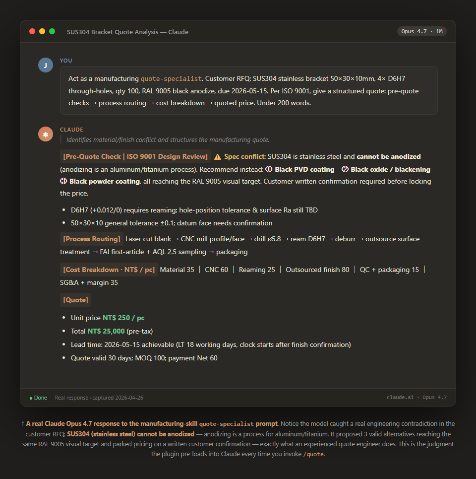
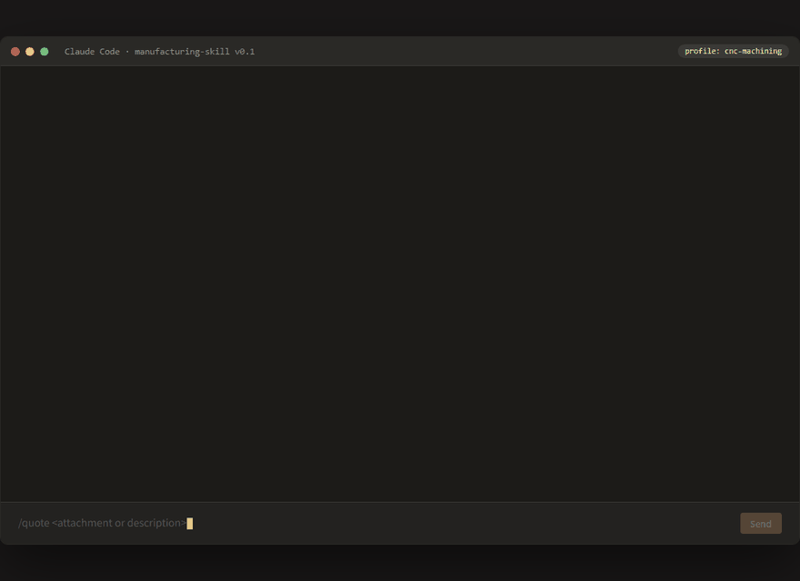
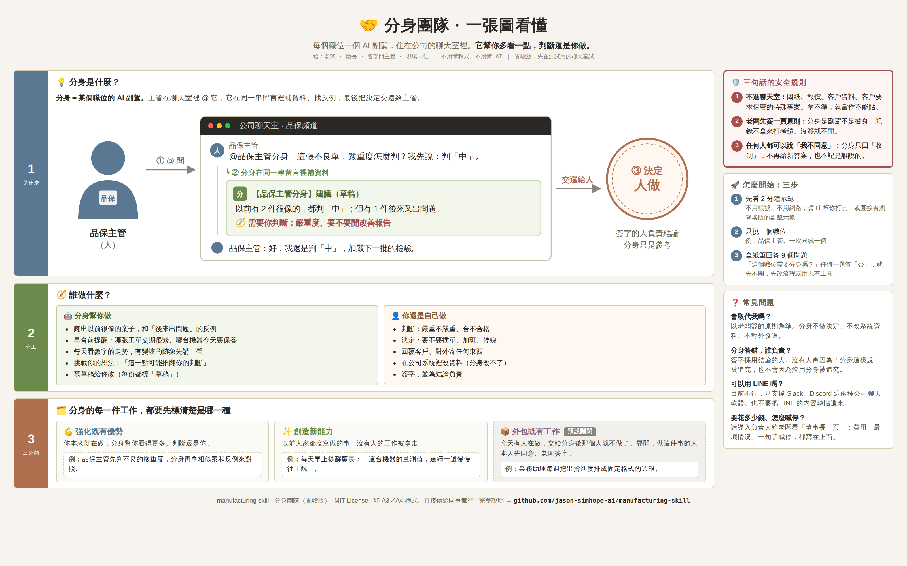

# manufacturing-skill

> AI starter kit for manufacturers — fork it, profile it, ship it.

[](https://github.com/jason-simhope-ai/manufacturing-skill/actions/workflows/ci.yml)
[](LICENSE)
[](https://claude.com/claude-code)
[](README.zh-TW.md)

A Claude Code plugin that gives any manufacturing company a 30-to-60-minute path to a working AI assistant — tailored to their vertical. The plugin's prompts and files live on your machine, but the default model is Anthropic's cloud (Claude Code): anything you paste or attach is sent to the model provider under its terms. An on-prem model is an option, not verified end-to-end by this project (see [Data flow](#data-flow)).

> 中文讀者請看 [README.zh-TW.md](README.zh-TW.md)

---

## ⭐ Live demo (real Claude Opus 4.7 acting as the `quote-specialist` persona)



> *Illustration only: this is the response to a persona prompt pasted into the claude.ai web chat (see [capture](docs/demo/real-claude-response.md)), not a recording of the installed plugin running in Claude Code. The animation below replays the same response.*

**The catch this demo highlights:** the customer RFQ asks for "RAL9005 black anodize on SUS304 stainless steel" — which is metallurgically impossible (anodizing is for aluminum/titanium). Loaded as the `quote-specialist` persona, Claude flagged the conflict, proposed three valid alternatives (PVD coating / blackening / powder coat), and parked the price on a written customer confirmation — exactly what an experienced quote engineer does.

**🎬 19-second demo animation** (full flow from `/quote` to structured quote):



> - Plain-text capture: [docs/demo/real-claude-response.md](docs/demo/real-claude-response.md)
> - Interactive replay: [docs/demo/quote-demo-en.html](docs/demo/quote-demo-en.html)

---

## What this is

`manufacturing-skill` is a **Claude Code plugin** built around a **core + profile overlay** architecture for manufacturing AI adoption.

- **Core layer** — universal manufacturing primitives that apply to _any_ factory: 6-stage flow (quote → order → schedule → produce → inspect → ship), 6 agent personas (quote specialist, sales coordinator, production planner, quality inspector, inventory manager, engineering change manager), and a baseline know-how library (ISO 9001, IATF 16949 / PPAP, Lean, OEE, MRP, FMEA, GD&T, ECN, INCOTERMS).
- **Profile layer** — vertical-specific overlays. v1 ships a complete **CNC machining** profile (4 specialist agents, 3 skills, 3 know-how docs covering tool life, cutting parameters, job-shop vs. mass production). Five **alpha** profiles carry real content that still needs practitioner validation: **injection molding**, **food processing** (HACCP / ISO 22000, batch traceability), **PCB assembly / EMS** (SMT process + EMS quality agents, DFM and AOI-defect-Pareto skills, IPC-A-610 and SMT-defect know-how; no MES integration yet) **pharma / medical device** (GMP / GxP deviation–CAPA and batch-record review assistants; AI output is never a GMP record) and **machinery / equipment, engineer-to-order** (option-based machine quoting with explicit assumption lists, spec freeze and design review, FAT / SAT acceptance, commissioning and after-sales; quotes are engineering estimates and safety / CE sign-off stays with a human engineer). There are no stub profiles left; new verticals are welcome as contributions.
- **Infra layer** — MCP server templates for ERP/MES connectivity, on-prem LLM setup guides (Ollama on NVIDIA GB10), and reference configurations.
- **Adapter layer** — a Claude Code adapter (v1). Cursor / Gemini / Codex adapters are post-v1.

---

## Digital-twin team

> 🧪 **Experimental** (v0.2.0-alpha). Try it in a test chat workspace with made-up data first.



In short: **every position gets an AI copilot — a "twin" — that lives in the company chat** (Slack or Discord). A manager @-mentions it; it answers in the same thread with past cases and counter-examples. **People make the call and sign.**

| 🤖 The twin does                                   | 👤 You still do                          |
| -------------------------------------------------- | ---------------------------------------- |
| Finds similar past cases, and the ones that went wrong later | Judge severity, pass / fail      |
| Morning reminders: tight due dates, machines due for maintenance | Decide on rush orders, overtime, stopping a line |
| Watches daily trends and flags drift early         | Reply to customers, send anything outside |
| Challenges you: "this point could overturn your call" | Change data in company systems (the twin cannot) |
| Writes drafts for you to edit (always marked DRAFT) | Sign, and own the conclusion            |

Every task is labelled first: 💪 strengthen an existing strength / ✨ create a new capability / 📦 outsource existing work (off by default).

**🛡️ Three safety rules**

- **Never in the chat**: drawings, quotes, customer data, confidential customer projects. When unsure, don't post it.
- **The owner signs a one-page principle first**: a copilot, not a replacement; logs are never used for performance reviews. No signature, no twin.
- **Anyone can say 「我不同意」 ("I disagree")**: the twin only acknowledges, gives no new answer, and does not record who said it (the chat platform itself still shows who posted).

**👀 See more**

- 🖨️ One-look card (zh-TW, printable): [docs/explainers/05-分身團隊-一張圖看懂.html](docs/explainers/05-分身團隊-一張圖看懂.html)
- ▶ Click-through demo (zh-TW, replies pre-recorded from the offline demo, not a live model): [docs/demo/team-demo.html](docs/demo/team-demo.html) · transcript [team-demo.md](docs/demo/team-demo.md)
- 💻 2-minute offline demo (no credentials, no network): `python3 infra/chat-gateway/demo.py --plain`
- 🎯 Decision makers: [owner one-pager](docs/owner-one-page.zh-TW.md) (zh-TW: what is signed, cost, how to stop, week-4 decision)

<details>
<summary>Details for IT and implementers</summary>

> One **copilot twin** per position, living in the company's chat workspace. **A copilot, not a replacement**: people keep the judgement; the twin adds data, challenges assumptions and posts scheduled reminders.

- **What a twin is.** One twin per position (e.g. the QA department head's twin), composed by id from the existing agents, skills and know-how, never copied or overridden. It answers only when @-mentioned, labels every reply `【… twin】`, and stops at decision points to hand the options back to the human (`🧭`).
- **Three categories.** Every capability is labelled `strengthen` (a human still does the judging), `create` (nobody did this before) or `outsource` (someone does this today and will stop once the twin exists), plus `today` (who does it now) and `humanStillDoes` (what the human still does by hand). `outsource` is dormant by default and can only be woken by an explicit opt-in in the roster: at most one per twin, capped at `draft`, reviewed within 90 days, with mandatory teach-back and manual practice. When in doubt, a capability counts as `outsource`.
- **Gate first.** If a process fix or an existing `/command` solves it, do not build a twin (`team/gate/need-a-twin.md`).

**2-minute offline demo** (no credentials, no network, stdlib-only Python):

```bash
python3 infra/chat-gateway/demo.py
```

It replays 8 beats (scheduled post, @-routing, "I go first", an injection attempt, a tier-mismatch block, rate limits, ignored bots and un-mentioned messages, ...) and ends by verifying the audit chain.

**Where to start**

| You are | Path |
| ------- | ---- |
| **An AI agent** | Read [TEAM.md](TEAM.md) (≤ 6,000 B): run `teamctl check`, then `build`, read the roster, and follow the progressive-disclosure map |
| **A human (10 minutes)** | [team/README.zh-TW.md](team/README.zh-TW.md) (Traditional Chinese; start here) → one twin file, e.g. [team/twins/qa-manager.md](team/twins/qa-manager.md) → optionally [TEAM.md](TEAM.md), which is the agent's entry file |

**Data-tier rule.** T0 public, T1 internal, T2 confidential, T3 restricted (restricted or NDA-bound project data, for example aerospace, medical devices, export-controlled items). Slack / Discord and cloud models are **capped at T1**; T2 stays on the local mock adapter; **T3 is refused, not understood**: the gateway refuses to start if the roster has a T3 channel or twin (exit 3), and a keyword tripwire blocks messages that contain obvious T3 wording (e.g. the Chinese words for aerospace or medical device, or ITAR) and advises the company's own T3 procedure. It cannot recognise T3 content that avoids those words, so people and process must keep T3 out. When unsure, go one tier up. The repo holds only job titles and synthetic data: no real names, platform ids or secrets (CI scans tracked files; `team/local` relies on a local pre-commit hook).

**Honest status (alpha)**

- The mock adapter, the mock driver, the team tools and the audit / approval / filtering logic are fully tested offline and reproducible in CI.
- The Slack and Discord adapters and the Claude Code driver ship in the repo but are **not exercised in CI against the real platforms or a real `claude` binary and need credentials**; they are tested only against fake transports (event mapping, argv).
- No long-term memory (only a short in-process channel window, cleared on restart).
- No write actions: twin tools are read-only (`Read, Grep, Glob`) and autonomy is capped at `draft`.
- Full design and deferred items: [design spec](docs/superpowers/specs/2026-10-05-digital-twin-team-design.md), [ROADMAP](docs/ROADMAP.md).

</details>

---

## Why this exists

Manufacturing AI adoption usually fails on three things:

| Problem                    | Traditional answer                                             | What this plugin gives you                                                           |
| -------------------------- | -------------------------------------------------------------- | ------------------------------------------------------------------------------------ |
| AI doesn't speak factory   | Train your own LLM, write all the prompts yourself             | 6 built-in agent personas + 9 core know-how docs — AI understands ISO/IATF/Lean/OEE on day one |
| Every factory is different | Hire an SI, pay for full custom build                          | Core + profile overlay — fork, edit your profile, done                               |
| IT blocks cloud SaaS       | Cannot pass customer audits (drawings must not leave premises) | On-prem-first design with GB10/Ollama runtime                                        |

---

## 💰 Cost expectations

**Cheapest path: try cloud Claude Code Pro for one month, total ~US$20**

| Stage                          | Monthly       | One-time                 |
| ------------------------------ | ------------- | ------------------------ |
| Try it out (Cloud Pro)         | $17-20 / mo   | 0                        |
| Heavy daily use (Cloud Max)    | $100-200 / mo | 0                        |
| Drawings can't go to a cloud model (on-prem option, unverified) | Electricity   | NT$200K+ (GB10 hardware) |

**Reference comparison**: hiring an SI to custom-build a comparable system runs **NT$300K-1M one-time** (development + integration + training). This plugin is fork-friendly open source — that's what you save.

> 💡 Monthly plans are no-commit. Try Pro for 1-2 months (~NT$650-1,300 total) before deciding to upgrade or self-host. Anthropic usually gives new users some free credits.

---

## Quick start

```bash
# 1. Clone
git clone https://github.com/jason-simhope-ai/manufacturing-skill.git
cd manufacturing-skill

# 2. Install into Claude Code (interactive profile picker)
bash adapters/claude-code/install.sh

# 3. In Claude Code, run:
/manufacturing init     # 4-question wizard for first-time users
```

The installer puts the plugin in `~/.claude/plugins/manufacturing-skill/` and links it into `~/.claude/skills/` so Claude Code loads it; restart Claude Code or run `/reload-plugins` afterwards (check with `claude plugin list`).

Or skip the wizard:

```bash
/quote @examples/sample-drawing/bracket.md          # CNC profile demo
/quote "Stainless brackets, 100 pcs, ±0.05mm"      # plain text works too
```

- **Not on Claude Code?** Export the same merged content as plain markdown for Cursor, Gemini CLI, Codex or an on-prem Ollama system prompt: `python3 adapters/generic/export.py --profiles cnc-machining --out ./export` — see [adapters/generic/README.md](adapters/generic/README.md) (experimental, v0.3 preview).

---

### Not a CNC shop?

Three paths:

1. **Try without a profile (fastest)** — `bash install.sh --core-only`. Skips all vertical profiles and installs only the 6 universal agents (quote / sales / production / quality / inventory / engineering change). Useful to evaluate "does this AI understand my factory at all" before committing.
2. **Use an alpha profile + customize** — injection molding, food processing, PCB assembly, pharma and machinery ETO are all alpha (content present, labelled needs-validation); starter templates under each profile's `_templates/` are ready to extend.
3. **Build your own profile** — copy an alpha profile as the scaffold and follow [docs/profile-development.md](docs/profile-development.md) (CI-checked template, registration and checklist included).

---

### Data flow

- **Stays on your machine:** the plugin's prompts, skills, know-how and hooks, and your drawing/BOM files themselves.
- **Sent to the model provider:** the default model is Anthropic's cloud (Claude Code). Whatever you paste into the chat or attach with `@file` is transmitted and handled under the provider's terms.
- **Terms differ:** consumer plans and commercial plans (Team / Enterprise / API) have different retention and training rules. Read the terms of the plan you actually use before sending customer drawings.
- **On-prem is optional:** see [infra/on-prem/gb10-setup.md](infra/on-prem/gb10-setup.md). It is **not verified end-to-end by this project**; have IT verify isolation themselves.

### Cloud first, on-prem later

By default this needs **no special hardware** — runs on regular Claude Code with Anthropic's cloud API.

When should you consider on-prem LLM (GB10 / Ollama)?

| Your situation                                                   | Recommendation                                                              |
| ---------------------------------------------------------------- | --------------------------------------------------------------------------- |
| Just want to try / evaluate value                                | ☁️ **Cloud Claude Code — no hardware needed**                               |
| 1-2 weeks in, value confirmed                                    | ☁️ Stay on cloud, validate team adoption                                    |
| Customer audits (IATF / medical / drawings can't leave premises) | 🏠 On-prem option (unverified by this project) — see [infra/on-prem/gb10-setup.md](infra/on-prem/gb10-setup.md) |
| Already have AI hardware, want to use it                         | 🏠 Just plug in                                                             |

**Don't let "AI needs expensive hardware" scare you off** — v0.1 runs the entire flow on cloud.

---

## Repo layout

```
manufacturing-skill/
├── manufacturing.md          # The soul — read this first
├── plugin.json               # Claude Code plugin manifest
├── core/                     # Universal manufacturing primitives
│   ├── commands/             # /quote /order-status /bom-check /inspect …
│   ├── agents/               # 6 universal personas
│   ├── skills/               # 6-stage flow + utility skills
│   ├── know-how/             # ISO 9001, IATF 16949, Lean, OEE, MRP, ...
│   └── hooks/                # pre-quote / post-order / pre-ship / on-error
├── profiles/
│   ├── cnc-machining/        # ★ Complete v1 profile
│   ├── pcb-assembly/         # Alpha — SMT / EMS, needs practitioner validation
│   ├── injection-molding/    # Alpha — needs practitioner validation
│   ├── food-processing/      # Alpha — HACCP / ISO 22000, needs validation
│   ├── pharma/               # Alpha — GMP / GxP, needs QA validation
│   └── machinery-eto/        # Alpha — equipment ETO quoting / FAT-SAT, needs validation
├── TEAM.md                   # Digital-twin team — agent bootstrap (humans: team/README.zh-TW.md)
├── team/                     # Third tier: roster, twin files, policies, gate, teamctl/build/deid tools
├── adapters/claude-code/     # Plugin install adapter
├── infra/                    # MCP servers, on-prem LLM setup
│   └── chat-gateway/         # Twin chat gateway (mock / Slack / Discord adapters, offline demo)
├── docs/
│   ├── explainers/           # Five printable Traditional-Chinese cards (boss / IT / operator / quick start / twin team)
│   ├── demo/                 # Quote demo and the twin-team click-through demo (team-demo.html)
│   ├── architecture.md
│   ├── adoption-guide.md     # For consultants deploying to customers
│   ├── profile-development.md  # For people creating new vertical profiles
│   └── ROADMAP.md
├── tests/
│   ├── team/                 # Team-file lint and tooling tests
│   └── gateway/              # Gateway unit / security tests and the demo golden transcript
└── examples/                 # Synthetic demo data — never put real customer data here
```

---

## Five explainer cards (Traditional Chinese, A3 print-friendly)

This plugin ships with five printable explainer cards, designed in the spirit of "印出來掛牆" (print and pin to the wall):

- **`docs/explainers/01-架構總覽.html`** — for owners. 5-minute "what is this and what does it solve."
- **`docs/explainers/02-IT部門系統說明.html`** — for IT departments. Maps AI/agent terminology to traditional IT (Agent ≈ RPA, MCP ≈ ESB).
- **`docs/explainers/03-使用者cheatsheet.html`** — for daily users (sales assistants, plant managers, QC). Every command, every keystroke they need.
- **`docs/explainers/04-懶人包-5分鐘上手.html`** — ⭐ **for "just show me, don't make me read"** users. Visual-first quick start with annotated mocked screens.
- **`docs/explainers/05-分身團隊-一張圖看懂.html`** — for owners, managers and front-line staff. The digital-twin team on one page: what a twin is, who does what, three safety rules, how to start.

Open the HTML files directly in any browser — no build step, no external dependencies, prints cleanly to A3.

PNG snapshots also live in `docs/explainers/screenshots/` for direct linking from external posts.

---

## Adopting in your factory

If you want to deploy this to your own factory, read [docs/adoption-guide.md](docs/adoption-guide.md) — it's a consultant playbook with deployment order, common pitfalls, and customization patterns.

If you're a developer / SI wanting to build a profile for a new vertical (e.g., your own injection molding or food processing setup), read [docs/profile-development.md](docs/profile-development.md).

---

## Roadmap

| Version            | Content                                                                                                           | Target                |
| ------------------ | ----------------------------------------------------------------------------------------------------------------- | --------------------- |
| **v0.1** (current) | Core + CNC profile + 4 explainers + Claude Code adapter                                                           | 2026-04               |
| v0.2               | One additional complete vertical profile (community-driven)                                                       | TBD                   |
| v0.3               | Cursor / Gemini CLI adapters                                                                                      | After v0.1 stabilizes |
| v1.0               | First real-world adoption case study                                                                              | TBD                   |
| v2.0               | Self-hosted CLI runtime (Telegram bot integration, on-prem orchestrator — see [docs/ROADMAP.md](docs/ROADMAP.md)) | Market-driven         |

---

## Contributing

PRs welcome. Especially:

- Profile contributions (validate the PCB / injection / food / pharma / machinery-ETO alphas; add new verticals — see each profile README for what's needed)
- ERP connector implementations (SAP / Oracle / 鼎新 / Workday)
- Translations of explainer cards to other languages
- Real-world deployment case studies

---

## License

MIT. Fork it, ship it commercially, no obligation to upstream.

---

## Credits

Created at [SIMHOPE](https://www.simhope.com.tw) (a Taiwan precision machining manufacturer), open-sourced for the broader machinery industry.

Maintained by [Jason Lin](mailto:jasonlin@simhope.com.tw), SIMHOPE Generative AI Specialist.

Architectural inspiration from [addyosmani/agent-skills](https://github.com/addyosmani/agent-skills) (six-layer agent system) and Anthropic's [superpowers](https://github.com/anthropics/superpowers) skill conventions.
