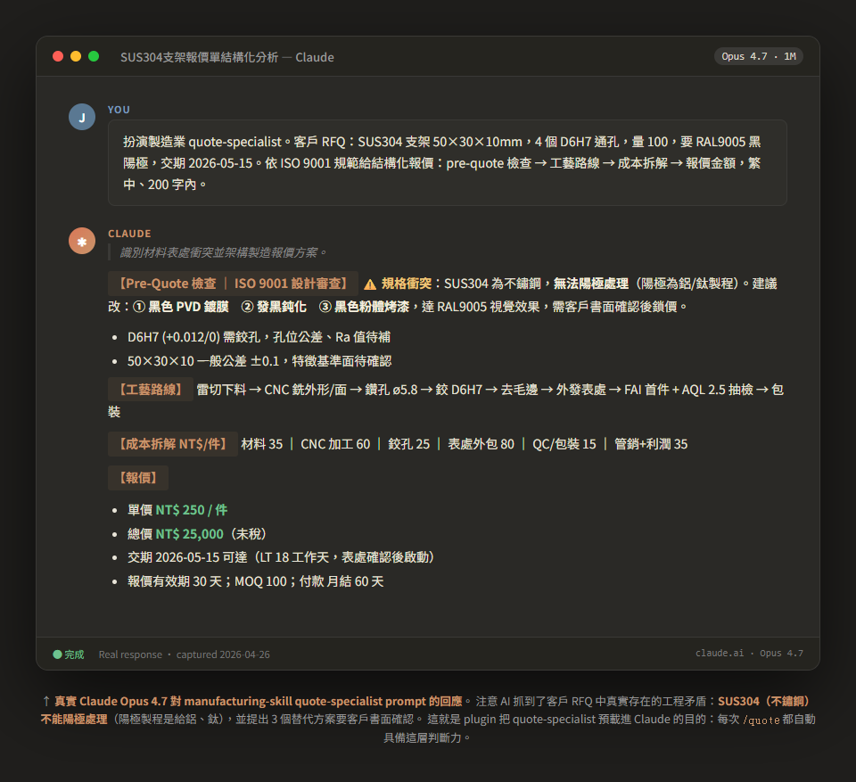
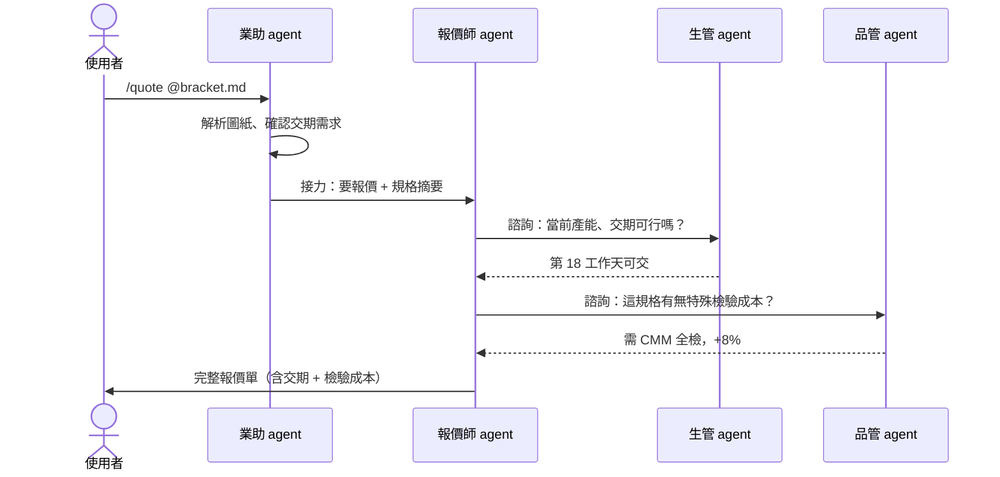

# manufacturing-skill

> Claude Code plugin · 30 分鐘把製造業 SOP 變成 AI 助理 — 跑在自己的電腦上、不外流圖紙。

[](https://github.com/jason-simhope-ai/manufacturing-skill/actions/workflows/ci.yml)
[](LICENSE)
[](https://claude.com/claude-code)
[](README.md)

---

**這份 README 給三種人看：**

- 🎯 **決策者**（老闆 / 廠長 / 接班人）→ 跳 [Demo 畫面](#demo-畫面) 跟 [這能做什麼](#這能做什麼)
- 🛠️ **導入者**（IT / 顧問 / 想動手的廠務）→ 從 [環境需求](#環境需求) 一路看到 [30 秒安裝](#30-秒安裝) 跟 [常見問題](#常見問題)
- 🧩 **開發者**（想做新產業包）→ 跳 [Repo 結構](#repo-結構) 跟 [profile-development.md](docs/profile-development.md)

> 📺 **完全沒寫過程式、沒用過 Claude Code、沒用過 ChatGPT？**
> 直接看 [**docs/quickstart-for-beginners.zh-TW.md**](docs/quickstart-for-beginners.zh-TW.md) — 假設你完全是新手，從下載 Claude Code 開始手把手教到第一個 AI 報價跑出來。看 README 卡住就翻這份。

---

## Demo 畫面

> ⭐ Claude Opus 4.7 對 quote-specialist prompt 的真實回應



**真實場景**：客戶 RFQ 寫「SUS304 不鏽鋼支架要 RAL9005 黑陽極」 — 工程上根本做不到（陽極處理是給鋁/鈦的）。
plugin 預載的 quote-specialist 馬上抓到這個矛盾、提出 3 個替代方案、parking 在客戶書面確認上才鎖價。

> - 完整文字版：[docs/demo/real-claude-response.md](docs/demo/real-claude-response.md)
> - ▶ 互動式 demo（瀏覽器點擊式回放）：[docs/demo/quote-demo.html](docs/demo/quote-demo.html) — 用 `python -m http.server 8080` 在 `docs/demo/` 跑起來
> - 🎬 30 秒 demo 影片：TODO（規劃中）

---

## 這能做什麼

簡單說：**裝起來後你會多 5 個內建懂製造業的 AI 同事**，幫你工廠做這 6 件事 ——

| #   | 場景                  | AI 同事幫你做                                                                |
| --- | --------------------- | ---------------------------------------------------------------------------- |
| 1   | 📞 **接報價**         | 客戶 RFQ 一進來，AI 自動算成本、估交期、組報價單；發現工程矛盾會主動提替代方案 |
| 2   | 📅 **排生產**         | 訂單接下來，AI 看當前產能能不能接、要不要加班、什麼時候交得出去             |
| 3   | 🏭 **追工單**         | 工單跑到哪了？哪台機台卡住了？哪個訂單可能延誤？隨時問                       |
| 4   | 🔍 **顧品管**         | 不良追蹤、客訴 8D 處理、IATF（汽車業品質體系）稽核準備 — AI 引導你跑完合規流程 |
| 5   | 📦 **管庫存**         | BOM 對帳、缺料預警、出貨檢查清單                                             |
| 6   | 🛠️ **客製給自己工廠** | 不是 CNC 廠？fork 一份改成你的行業（PCB / 射出 / 食品 / 製藥都有起點範本）  |

**5 個 AI 同事是誰：** 報價師、業助、生管、品管、倉管 — 各司其職、會互相接力（看下面 Mermaid 圖）。

**為什麼跟一般 ChatGPT 不一樣？** 一般 ChatGPT 不知道「IATF 16949 是什麼」「不鏽鋼不能陽極」這種行業 know-how，要每次自己貼背景才會答對。這個 plugin 把這些知識預載進 5 隻 AI 同事，**你不用每次重講一遍**。

---

<details>
<summary>給工程師看的架構細節（決策者跟導入者可以跳過）</summary>

採用「**core + profile overlay**」架構：

- **Core 層** — 普世製造業基本功：6 段流程 + 5 隻 agent + 通用 know-how（ISO 9001、Lean、OEE、MRP）
- **Profile 層（產業包）** — 各行業別加碼。v1 完整支援 CNC 精密加工（4 隻專精 agent、3 個 skill、4 份 know-how 涵蓋 IATF 16949、刀具壽命、切削參數、開發工廠 vs 量產）。其他 4 個產業包（PCB / 射出 / 食品 / 製藥）是 stub
- **Infra 層** — MCP server template 接 ERP/MES、地端 LLM 安裝指南（Ollama on NVIDIA GB10）
- **Adapter 層** — Claude Code adapter（v1）。Cursor / Gemini / Codex adapter 排在 v1 之後

</details>

---

## Agent 之間怎麼協作

看完 demo 最常被問的問題：「5 隻 AI 同事是怎麼接力的？」一張圖說明。

### 流程：以 `/quote` 為例



### 5 隻通用 agent · 各司其職

| Agent       | 角色             | 何時被呼叫              | 主要接力對象       |
| ----------- | ---------------- | ----------------------- | ------------------ |
| 🧮 報價師   | 算圖紙成本、組報價單 | `/quote`、客戶詢價      | 業助、生管、品管   |
| 📞 業助     | 客戶溝通、訂單拆解 | `/order-status`、客訴   | 報價師、生管       |
| 📅 生管     | 排程、產能評估   | 排單、交期確認          | 報價師、倉管       |
| 🔍 品管     | 檢驗計畫、不良追蹤 | `/inspect`、`/8d`       | 業助、倉管         |
| 📦 倉管     | 庫存、BOM 對帳   | `/bom-check`、缺料      | 生管、品管         |

> CNC 產業包再加 4 隻（CAM 工程師、刀具管理、量測技師、首件確認），詳見 [profiles/cnc-machining/](profiles/cnc-machining/)。

---

## 為什麼有這個 plugin

製造業導入 AI 通常死在三件事：

| 痛點              | 傳統作法                                | 本 plugin 提供                                               |
| ----------------- | --------------------------------------- | ------------------------------------------------------------ |
| AI 不懂製造業術語 | 自己訓 LLM、自己寫 prompt（卡在沒人會） | 5 隻內建 agent + 4 份 know-how，AI 開箱就懂 ISO / Lean / OEE |
| 各家流程都不一樣  | 找 SI 客製，超貴超慢                    | core + profile overlay，企業 fork 後改產業包即可             |
| IT 部門擋資安     | 雲端 SaaS 過不了客戶稽核                | 預設地端 GB10/Ollama，圖紙不出公司                           |

---

## 環境需求

| 項目                  | 需求                            | 備註                                                      |
| --------------------- | ------------------------------- | --------------------------------------------------------- |
| **Claude Code**       | ✅ 必要                         | 這個 plugin 跑在 Claude Code，**不是** claude.ai 網頁     |
| **作業系統**          | Windows / macOS / Linux 皆可    | Windows 建議用 Git Bash 或 WSL                            |
| **Anthropic 帳號**    | ✅ 必要                         | 安裝完 Claude Code 後 `claude login` 完成登入             |
| **Git**               | ✅ 必要                         | 安裝過程要 clone repo                                     |
| **桌面版 app（選配）**| 可不裝                          | 桌面 app 內建 terminal，CLI 跟桌面 app 兩條路擇一即可     |
| **GPU / 地端 LLM**    | ❌ 不需要（v0.1 純雲端就能跑） | 客戶會稽核圖紙時才考慮，見下方 [Cloud first, on-prem later](#cloud-first-on-prem-later) |

---

## 30 秒安裝

> 💡 **不會 git / bash 也別擔心：** [新手指南](docs/quickstart-for-beginners.zh-TW.md) 把這幾行指令一行一行解釋給你看，含 Windows / Mac 安裝流程跟錯誤排除。

```bash
# 1. Clone
git clone https://github.com/jason-simhope-ai/manufacturing-skill.git
cd manufacturing-skill

# 2. 裝進 Claude Code（互動選產業包）
bash adapters/claude-code/install.sh
# 會出現選單，列出 5 個產業包選項 + "core-only 純試框架" 選項

# 3. 試試看（在 Claude Code 內）
/manufacturing init     # ← 第一次用打這個，AI 會引導 4 個問題
```

或者直接 skip 引導：

```bash
/quote @examples/sample-drawing/bracket.md   # CNC 產業包 demo
/quote 「我做不鏽鋼五金件，幫我寫一份報價流程」  # 純文字描述也可以
```

---

## 常見問題

**Q: 我打開 claude.ai 網頁能直接用嗎？**
A: **不能。** claude.ai 跟 Claude Code 是兩個不同產品 — claude.ai 是瀏覽器聊天（像 ChatGPT 那樣），Claude Code 是裝在你電腦上的工具。
這個 plugin 需要：讀本機檔案（圖紙、BOM）、跑 install.sh、執行 slash command + multi-agent 接力 — 這些 claude.ai 網頁全部做不到。
要分清楚：claude.ai 最近也有「Skills」這個東西，但它跟 Claude Code 的 skill **同名不同物** — 前者在 Anthropic 雲端跑、不能存取你的本機；後者在你的電腦跑、可以讀檔跑指令。`manufacturing-skill` 屬於後者。

**Q: 一定要用終端機嗎？看到黑窗會怕。**
A: 不一定。Claude Code **桌面 app** 內建 terminal、有圖形介面，跟一般 app 一樣點開就能用。你只需要在它的對話框打 `/quote @bracket.md` 這種指令。

**Q: VS Code 裡也能用嗎？**
A: 可以。Claude Code 有 VS Code 整合，安裝完 plugin 後在 VS Code 裡照樣呼叫所有 `/` 指令。

**Q: 我不是 CNC 廠也能用嗎？**
A: 可以，三種選法 ——
1. **Try without a profile（最快）** — 跑 `bash install.sh --core-only`，跳過所有產業包，只裝 5 隻通用 agent。直接用通用問答試「AI 懂不懂我的工廠」。
2. **Stub 加碼客製** — 若你是 PCB / 射出 / 食品 / 製藥，那個產業包是 stub 但有 starter template，照著填內容就能用。
3. **Fork CNC 產業包改成你的** — CNC 產業包是最完整的範本，fork 一份做自己的產業包是最快路徑（詳見 [docs/profile-development.md](docs/profile-development.md)）。

---

### Cloud first, on-prem later

預設**不需要任何特殊硬體** — 用一般電腦的 Claude Code 直接跑就行（雲端 Anthropic API）。

什麼時候才考慮地端 LLM（GB10 / Ollama）？

| 你的情境 | 建議 |
|---|---|
| 想先試試看、確認價值 | ☁️ **雲端 Claude Code，不用買硬體** |
| 跑了 1-2 週覺得有用 | ☁️ 繼續雲端，確認團隊接受度 |
| 客戶會稽核（IATF / ISO 醫材 / 圖紙不可外流） | 🏠 才考慮地端 — 詳見 [infra/on-prem/gb10-setup.md](infra/on-prem/gb10-setup.md) |
| 公司本來就買了 AI 硬體想物盡其用 | 🏠 直接接上就好 |

**先別被「AI 要花一筆設備錢」嚇跑** — v0.1 純雲端就能跑完整流程。

---

## Repo 結構

```
manufacturing-skill/
├── manufacturing.md          # 靈魂入口文件 — 先讀這個
├── plugin.json               # Claude Code plugin manifest
├── core/                     # 普世製造業基本功
│   ├── commands/             # /quote /order-status /bom-check /inspect …
│   ├── agents/               # 5 隻 universal persona
│   ├── skills/               # 6 段流程 + 通用 skill
│   ├── know-how/             # ISO 9001、Lean、OEE、MRP
│   └── hooks/                # pre-quote / post-order / pre-ship / on-error
├── profiles/                 # 產業包
│   ├── cnc-machining/        # ★ v1 唯一完整產業包
│   ├── pcb-assembly/         # Stub — 歡迎 contribute
│   ├── injection-molding/    # Stub
│   ├── food-processing/      # Stub
│   └── pharma/               # Stub
├── adapters/claude-code/     # 一鍵安裝
├── infra/                    # MCP server、地端 LLM 設定
├── docs/
│   ├── explainers/           # 三張可印 A3 的繁中說明卡
│   ├── architecture.md
│   ├── adoption-guide.md     # 給 AI 導入顧問的 playbook
│   ├── profile-development.md  # 給想做新產業包的開發者
│   └── ROADMAP.md
└── examples/                 # 合成 demo data — 絕對不要放真實客戶資料
```

---

## 三張 explainer 卡 — 印出來掛牆

本 plugin 預設有四張可印 A3 的繁中說明卡（呼應「印出來掛牆」精神）：

- **`docs/explainers/01-架構總覽.html`** — 給老闆。5 分鐘看懂這能解決什麼。
- **`docs/explainers/02-IT部門系統說明.html`** — 給 IT。把 AI 術語對照成傳統 IT（Agent ≈ RPA、MCP ≈ ESB）。
- **`docs/explainers/03-使用者cheatsheet.html`** — 給業助 / 廠長 / 品管。每天會用到的指令快查。
- **`docs/explainers/04-懶人包-5分鐘上手.html`** — ⭐ **給「不想看文字直接看截圖」的人**。一頁式視覺操作流程。

直接用瀏覽器打開 HTML 檔即可，無 build step、無外部依賴、印 A3 看得清楚。

---

## 我要在自己的工廠導入

→ 讀 [docs/adoption-guide.md](docs/adoption-guide.md)。

裡面有 Jason 用過的導入順序、踩雷清單、客製化指引。

如果你是想做新產業包（例如食品廠或射出廠），→ 讀 [docs/profile-development.md](docs/profile-development.md)。

---

## Roadmap

| 版本             | 內容                                                                                             | 預期           |
| ---------------- | ------------------------------------------------------------------------------------------------ | -------------- |
| **v0.1**（目前） | Core + CNC 產業包 + 4 張 explainer + Claude Code adapter                                         | 2026-04        |
| v0.2             | 補完一個其他產業包（看社群貢獻）                                                                 | TBD            |
| v0.3             | Cursor / Gemini CLI adapter                                                                      | v0.1 stable 後 |
| v1.0             | 第一個真實導入 case study                                                                        | TBD            |
| v2.0             | 自建 CLI runtime（Telegram bot 整合、地端 orchestrator — 見 [docs/ROADMAP.md](docs/ROADMAP.md)） | 看市場         |

---

## 一起 contribute

PR 都歡迎，特別是：

- 新產業包（PCB / 射出 / 食品 / 製藥 — 看 stub 裡的 README 知道要做什麼）
- ERP connector 實作（SAP / Oracle / 鼎新 / Workday）
- explainer 卡片翻譯成其他語言
- 真實導入 case study

---

## License

MIT。Fork 走、商用、不用回饋（但回饋了會很開心）。

---

## 致謝

由 [SIMHOPE](https://www.simhope.com.tw)（台灣精密機械製造商）內部實踐後 open source。

維護者：[Jason Lin](mailto:jasonlin@simhope.com.tw)，SIMHOPE 生成式 AI 專案執行專員。

架構靈感來自 [addyosmani/agent-skills](https://github.com/addyosmani/agent-skills)（六層 agent 系統）與 Anthropic [superpowers](https://github.com/anthropics/superpowers) skill 規範。
