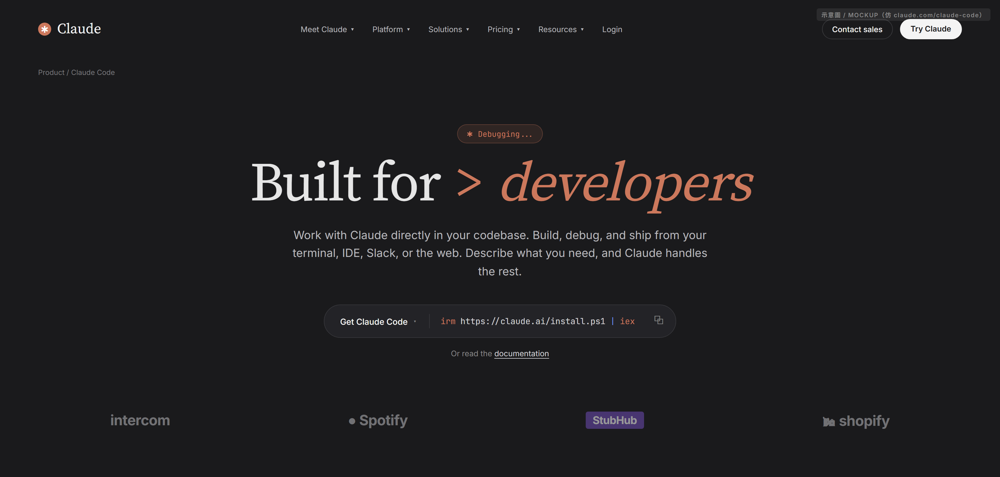
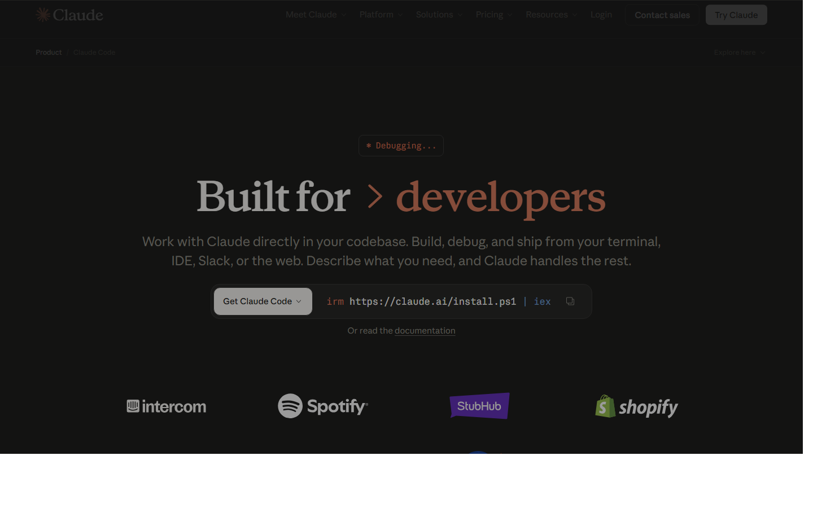
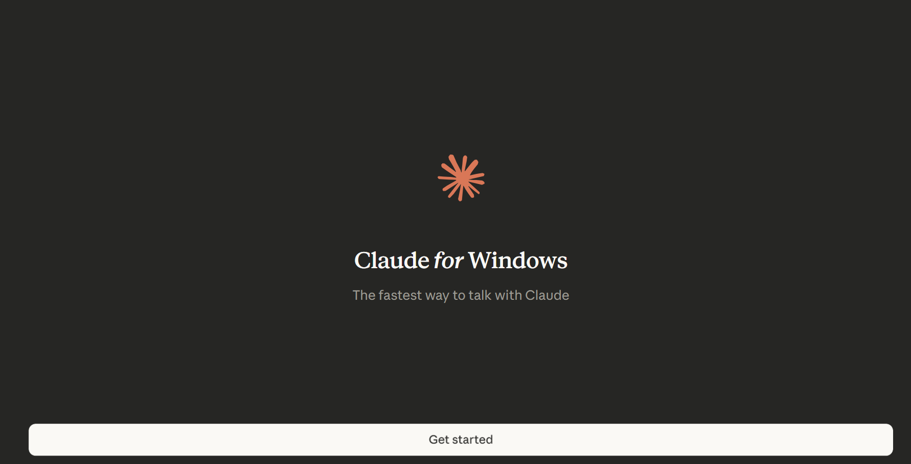
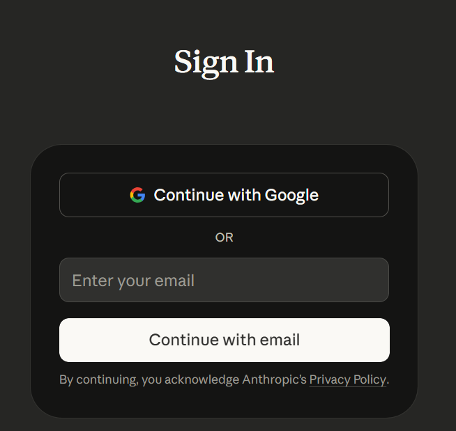
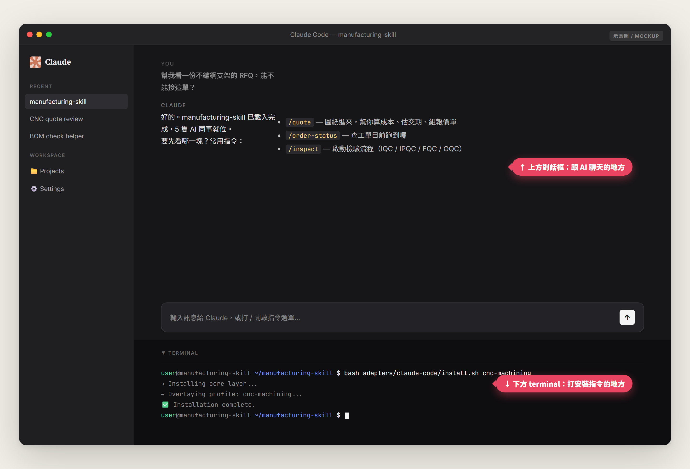
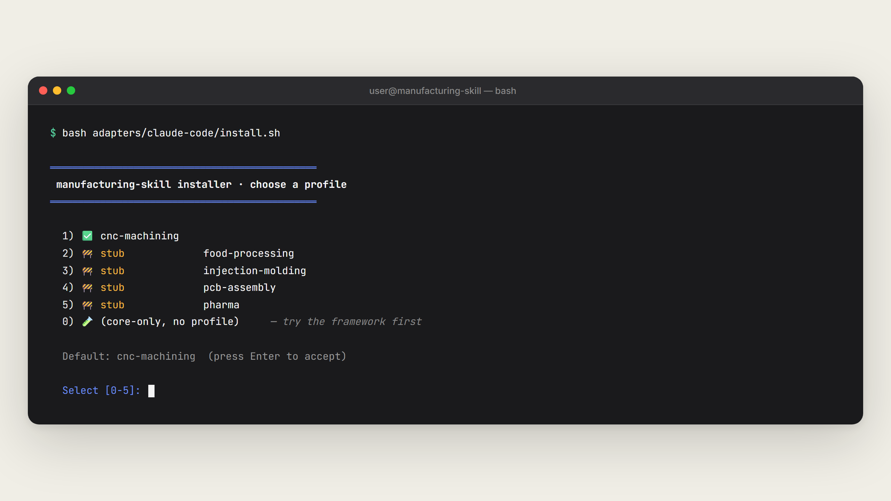
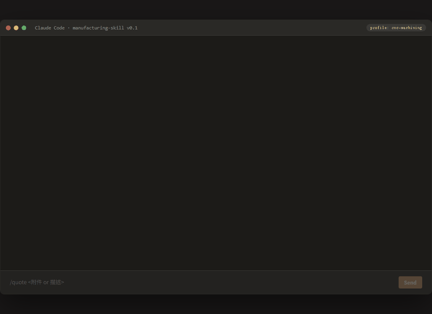

# 給完全新手的安裝指南

> **這份是給：沒寫過程式、沒用過 ChatGPT 或 Claude、只有一台 Windows 或 Mac 電腦、想花 30-60 分鐘試試這個能不能用的人。**
>
> 如果你符合上面任何一條，這份就是寫給你看的。看完應該能跑通第一個 AI 報價指令。

---

## 你需要準備什麼

| 項目                  | 說明                                                                                                                                                                             |
| --------------------- | -------------------------------------------------------------------------------------------------------------------------------------------------------------------------------- |
| 時間                  | 約 30-60 分鐘（看安裝順不順）                                                                                                                                                    |
| 一台電腦              | Windows 或 Mac 都可以（Linux 也可以但這份不教）                                                                                                                                  |
| 一個 email 信箱       | 註冊 Anthropic 帳號用，Google 或 Apple 帳號也可以                                                                                                                                |
| 信用卡 / 額度（選配） | Claude Code 訂閱方案：**Pro $17/月**（年繳）或 $20/月（月繳） / Max 5x $100/月 / Max 20x $200/月。新手選 Pro 即可，詳見 [claude.com/claude-code](https://claude.com/claude-code) |

> ⚠️ **不需要：** 不需要會寫程式、不需要懂 Linux、不需要買 GPU、不需要架伺服器。

> 💡 **如果你連「打開 terminal」都不確定怎麼做：** 找你公司 IT 同事陪你跑 Step 1-3 一次（約 20 分鐘），跑通後 Step 4 之後你自己用。這個 plugin 真正每天會用到的部分（打 `/quote`）跟用 LINE 一樣簡單，難的只有第一次安裝。

---

## Step 1：下載並安裝 Claude Code（10-20 分鐘）

「Claude Code」是這個 plugin 跑的軟體環境。它**不是** ChatGPT、**不是** claude.ai 網頁，是**你裝在自己電腦上**的工具。

### 1-1 開啟官方下載頁

打開瀏覽器，貼這個網址：

```
https://claude.com/claude-code
```

> ⚠️ **常見搞混：** `claude.ai` 是純聊天網頁版（像 ChatGPT），**不能裝 plugin**。你要去的是 `claude.com/claude-code`（注意是 `.com` 不是 `.ai`、後面要加 `/claude-code`）。

### 1-2 照官方指示裝（兩條路二選一）

> ⚠️ **先別被官網嚇到：** 官網開頭寫「**Built for developers**」並且首推一行 PowerShell 安裝指令（`irm https://claude.ai/install.ps1 | iex`），對完全新手不友善。**先往下捲到「Use Claude Code where you work」區塊，找 Desktop 欄位**，那才是給新手的路。

| 方式                     | 適合誰                                      | 怎麼裝                                                                                                                                               | 難度      |
| ------------------------ | ------------------------------------------- | ---------------------------------------------------------------------------------------------------------------------------------------------------- | --------- |
| **🖥️ 桌面 app（推薦）**  | 完全沒寫過程式的人 ⭐                       | 在官網往下捲找「**Download Claude for desktop**」按鈕 → 下載 → 雙擊安裝（跟裝 LINE / Word 一樣）                                                     | ⭐ 最簡單 |
| **⌨️ 一行 install 指令** | 已經會用 Windows PowerShell 或 Mac Terminal | **Windows**：開 PowerShell 貼 `irm https://claude.ai/install.ps1 \| iex` — **Mac**：開 Terminal 貼 `curl -fsSL https://claude.ai/install.sh \| bash` | ⭐⭐ 中等 |
| **VS Code 整合**         | 已經在用 VS Code 的工程師                   | VS Code 擴充市集搜「Claude Code」                                                                                                                    | ⭐⭐ 中等 |

> 💡 **完全新手：選桌面 app。** 跟裝 LINE / Word 一樣，下載 → 雙擊 → 點下一步 → 完成。安裝完桌面會出現 Claude 的 icon，雙擊就打開。

**📸 官網開頭長這樣**（注意「Built for developers」字樣 + 下方那行 `irm ... | iex` PowerShell 指令 — 這就是「對新手不友善」的地方）：



**📸 往下捲到 Download Claude 頁，會看到桌面 app 路徑**（macOS / Windows / Windows arm64 / iOS / Android）：



### 1-3 確認裝起來了

裝完後桌面（Windows）或 Launchpad（Mac）會出現 **Claude Code** icon。雙擊打開，看到登入畫面就成功了。

---

## Step 2：登入帳號（5 分鐘）

第一次打開 Claude Code 會要你登入。

1. 看到登入畫面，最簡單的方式是點「**Continue with Google**」
2. 瀏覽器會跳出來，選你的 Google 帳號授權
3. 回到 Claude Code，看到主畫面（一個對話框 + 下方 terminal 區）

如果還沒訂閱，可能會跳訂閱頁面。**先別緊張**：

- Claude Code 通常給新用戶一些免費 credit 試
- 訂閱方案三選一：
  - **Pro $17/月**（年繳）或 **$20/月**（月繳）— ⭐ 新手選這個就好
  - Max 5x — $100/月（重度使用者）
  - Max 20x — $200/月（超重度使用者）
- 月繳不綁約，隨時可以取消
- 確切收費以 [官網價目頁](https://claude.com/claude-code) 為準

**📸 第一次打開桌面 app 看到這個 splash 畫面，按「Get started」開始登入流程：**



**📸 接著看到登入畫面，最簡單的是按「Continue with Google」：**



---

## Step 3：把這個 plugin 裝進去（5 分鐘）

Claude Code 主畫面有兩塊：

- **上方對話框** — 跟 AI 聊天的地方（之後 Step 4 會用）
- **下方 terminal** — 黑底白字、可以打指令的地方（Step 3 在這邊）



> 💡 **找不到 terminal？** 在 Claude Code 裡按 `Ctrl + 反引號`（鍵盤左上角，數字 1 旁邊那顆 `` ` ``）切換顯示。Mac 也是一樣按法。

### 3-1 把這 3 行貼到 terminal

**一行一行貼**，每行貼完按 Enter 等它跑完，再貼下一行：

```bash
git clone https://github.com/jason-simhope-ai/manufacturing-skill.git
```

```bash
cd manufacturing-skill
```

```bash
bash adapters/claude-code/install.sh
```

> 💡 **每一行在做什麼？**
>
> - 第 1 行：從 GitHub 把 plugin 下載到你電腦
> - 第 2 行：進入剛下載的資料夾
> - 第 3 行：跑安裝程式

### 3-2 安裝程式會問你「要裝哪個產業包」

第 3 行跑完後會跳出選單，長這樣：

```
════════════════════════════════════════════════
 manufacturing-skill installer · choose a profile
════════════════════════════════════════════════

  1) ✅ cnc-machining
  2) 🚧 stub food-processing
  3) 🚧 stub injection-molding
  4) 🚧 stub pcb-assembly
  5) 🚧 stub pharma
  0) 🧪 (core-only, no profile)     — try the framework first

  Default: cnc-machining  (press Enter to accept)

  Select [0-5]:
```

**怎麼選？**

| 你是什麼工廠             | 選哪個                                             |
| ------------------------ | -------------------------------------------------- |
| CNC 加工廠               | 直接按 **Enter**（預設選 1）                       |
| 不是 CNC、想先試框架     | 打 **0** 按 Enter                                  |
| PCB / 射出 / 食品 / 製藥 | 也建議先打 **0** — 對應產業包目前是 stub（半成品） |

按完 Enter，等個 5-10 秒，看到 `✅ Installation complete.` 就成功了。



---

## Step 4：第一個 AI 指令（5 分鐘）

裝好 plugin 後，**移到上方對話框**（不是 terminal），打這個：

```
/quote @examples/sample-drawing/bracket.md
```

然後按 Enter。

> 💡 **`/` 是什麼？** 在 Claude Code 對話框裡，`/` 開頭代表「指令」。`/quote` 就是「叫報價師 AI 幫我報價」。

> 💡 **`@` 是什麼？** `@` 後面接檔案路徑代表「把這份檔案餵給 AI 讀」。`bracket.md` 是我們附的範例圖紙說明。

### 預期會看到什麼？

按 Enter 後，AI 會：

1. 顯示「正在讀圖紙...」
2. 列出客戶需求（不鏽鋼五金件報價）
3. **發現工程矛盾** — 客戶要 SUS304 不鏽鋼陽極處理，但陽極處理只能用在鋁／鈦上
4. 提出 3 個替代方案給你選
5. 暫停在「等客戶書面確認後再鎖價」

整個過程約 30 秒到 2 分鐘。

✅ **看到 AI 自己抓到「不鏽鋼不能陽極」這個矛盾 = plugin 在工作。**

**🎬 19 秒動畫示意：使用者打 `/quote` → AI 抓矛盾 → 補資訊 → 出完整報價單**



> 想看靜態截圖版（適合對著讀的學習）：[step6-quote-success-mockup.png](quickstart-screenshots/step6-quote-success-mockup.png)

---

## Step 5：怎麼問下一句（看不懂答案怎麼辦）

AI 給的答案看不懂？**直接打中文問**就好，不用學任何指令。例如：

- 「這個交期 18 工作天怎麼算的？」
- 「為什麼價錢加 8%？」
- 「如果客戶堅持要陽極處理，有沒有其他做法？」
- 「我們公司不做不鏽鋼的，這份報價對我有什麼意義？」

AI 會記得前面對話的脈絡，順著你的問題回答。

> 💡 **不確定 AI 講對還是講錯？**
> 直接打「不對，我們公司的規則是 XXX」就好，AI 會記住並修正。AI 不會因為你糾正它而生氣。

> 💡 **AI 說的不能 100% 信。** 它是助理不是老闆，重要決策（鎖價、簽合約、改 BOM）還是要你親自確認。把它當「永遠值班、不會累、會被糾正的新進業助」來用就對了。

---

## 常見錯誤排除

### ❌ Step 3 跑第一行就錯：`git: command not found`

代表你電腦沒裝 git。解決：

**Windows：** 開瀏覽器到 https://git-scm.com/download/win 下載 → 雙擊安裝 → 全部按下一步即可 → 裝完**重開** Claude Code → 重跑 Step 3

**Mac：** terminal 打 `xcode-select --install` 按 Enter，跳出對話框點「安裝」→ 等 5 分鐘裝完 → 重跑 Step 3

### ❌ Step 3 跑第三行錯：`bash: command not found`

代表你不是在 terminal 裡執行。確認你打字的地方有黑底白字、上面有 `$` 或 `>` 提示符號才是 terminal。如果你打字的地方是「對話框」（給 AI 的），那是 Step 4 的位置，不是 Step 3。

### ❌ Step 4 打 `/quote` 沒反應、說 `command not found`

代表 plugin 沒裝起來。重跑 Step 3 第三行，確認最後有看到 `✅ Installation complete.`。

如果 Step 3 跑完正常但 `/quote` 還是不認，**完全關掉 Claude Code 重開一次**（讓它重新載入 plugin）。

### ❌ Step 3 中間說 `Permission denied`

Mac / Linux 偶爾會這樣。解法：在指令前加 `sudo`：

```bash
sudo bash adapters/claude-code/install.sh
```

會要你打電腦開機密碼（打的時候畫面不會顯示，正常的，打完按 Enter）。

### ❌ 跑到一半卡住、沒反應

按 `Ctrl + C` 中斷，回到提示符號重新打。

### ❌ 跑了沒錯但 AI 答得很亂、答非所問

可能是模型版本太舊。在 Claude Code 的設定（Settings）裡確認用的是 **Claude Opus 4.7** 或 **Claude Sonnet 4.6**（這個 plugin 在這兩版上實測過）。

---

## 接下來做什麼

| 跑通 `/quote` 後想做的事       | 看哪份文件                                                                                                                            |
| ------------------------------ | ------------------------------------------------------------------------------------------------------------------------------------- |
| 試其他指令（接單、品管、客訴） | 印 [docs/explainers/03-使用者cheatsheet.html](explainers/03-使用者cheatsheet.html) 掛牆上                                             |
| 想了解這 plugin 怎麼運作       | 回 [README.zh-TW.md](../README.zh-TW.md) 看「Agent 之間怎麼協作」段                                                                   |
| 想正式導入工廠                 | 看 [docs/adoption-guide.md](adoption-guide.md)（給導入顧問看的 SOP）                                                                  |
| 想做自己行業的產業包           | 看 [docs/profile-development.md](profile-development.md)                                                                              |
| 卡住、有問題                   | [開 GitHub Issue](https://github.com/jason-simhope-ai/manufacturing-skill/issues) 或 mail [Jason Lin](mailto:jasonlin@simhope.com.tw) |

---

> 📌 **本文件截圖狀態：**
>
> - ✅ Step 1（Claude Code hero、Download Claude 頁）— **真實截圖**
> - ✅ Step 2（Claude for Windows splash、Sign In）— **真實截圖**
> - 🎨 Step 3（主畫面、安裝選單）— **示意圖（mockup）**，左上角有「示意圖 / MOCKUP」標記，原始 HTML 在 [`docs/quickstart-screenshots/mockups/`](quickstart-screenshots/mockups/)
> - 🎨 Step 4（`/quote` 成功 output）— **示意圖**，文字內容 100% 來自真實 Claude Opus 4.7 回應（見 [docs/demo/real-claude-response.md](demo/real-claude-response.md)）
>
> 如果你照這份做卡在某一步，**請直接 [開 issue](https://github.com/jason-simhope-ai/manufacturing-skill/issues) 告訴我們你卡哪、看到什麼錯誤訊息**，我們會優先補那一段。你的回饋直接讓這份指南變更好。
