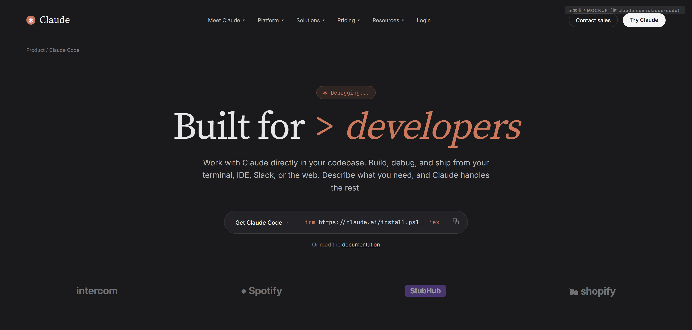
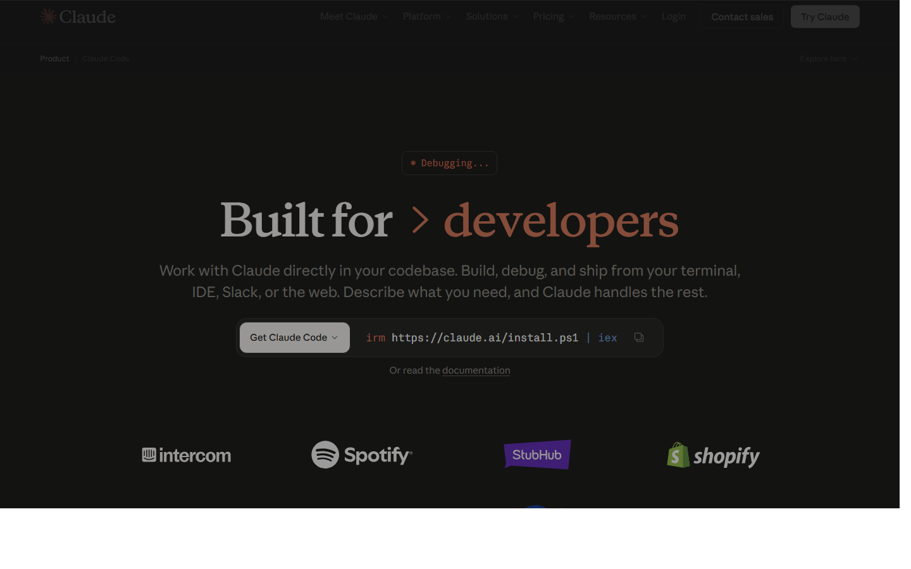
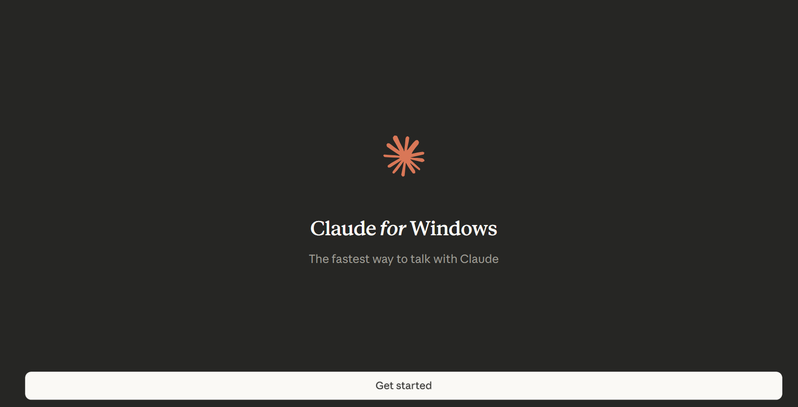
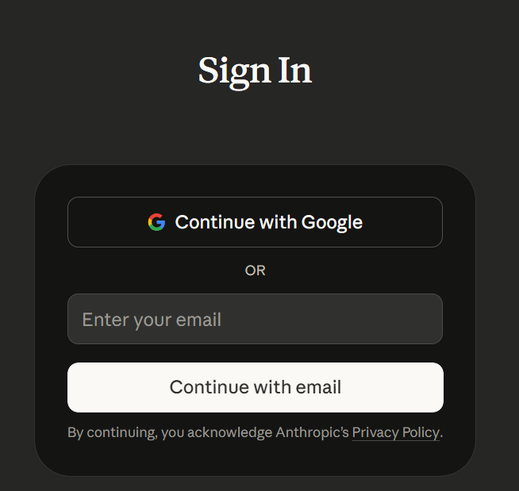
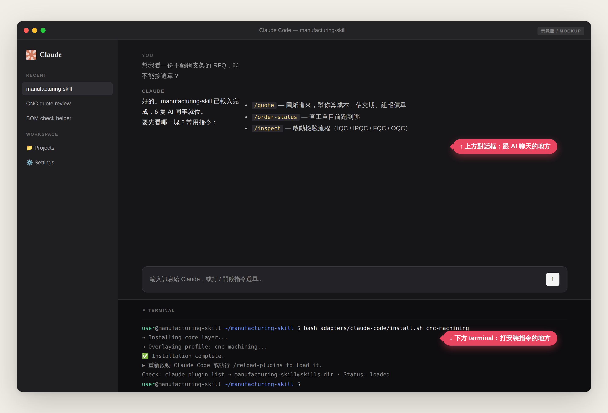
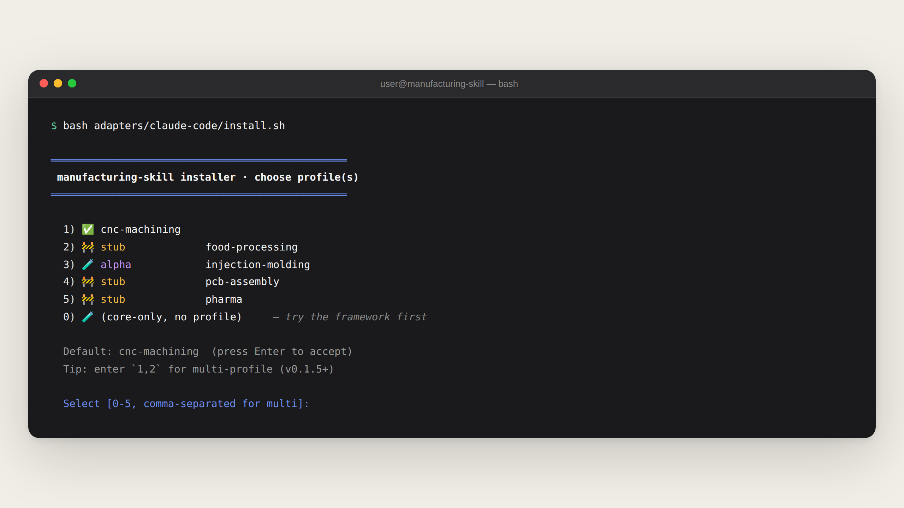
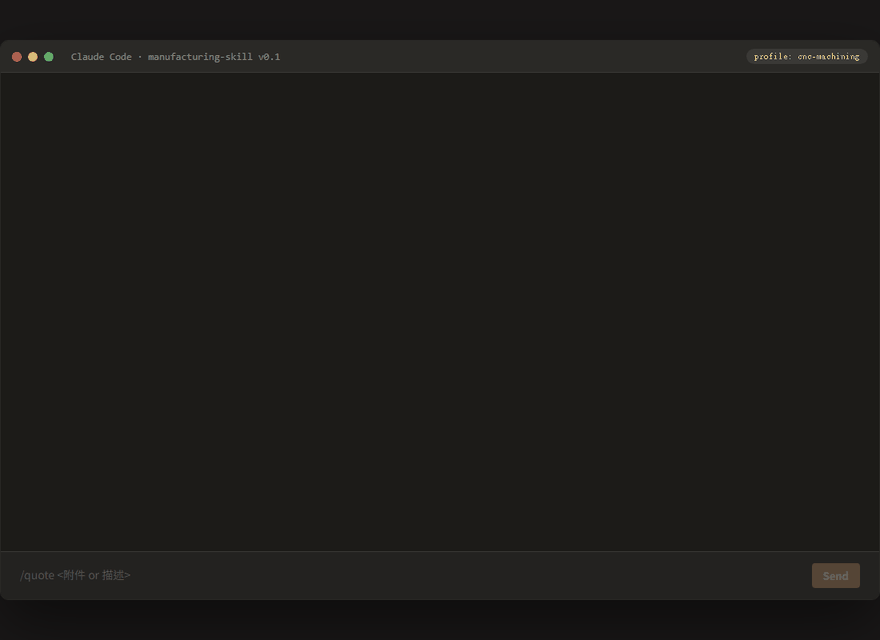

# 給完全新手的安裝指南

> 👥 **給誰看**：從來沒用過 Claude Code、也沒用過 ChatGPT 的人。不用會寫程式，有一台 Windows 或 Mac 電腦就好。全部做完約 30–60 分鐘。
> 🎁 **做完你會有什麼**：你的電腦上會有 Claude Code，裡面多了 6 位懂製造業的「AI 同事」（報價師、業助、生管、品管、倉管、工程變更）。你會親眼看到報價師抓出一張範例圖紙裡的規格矛盾。
> 🧭 **這份只裝 AI 同事**：照這份做（README 叫它「30 秒安裝」），AI 同事會裝進你電腦上的 Claude Code。聊天室裡的「分身團隊」、連接聊天室的轉接程式（gateway）和連接公司系統的接頭（MCP server），要用下載下來的整個專案資料夾（工程師叫它 checkout）來跑，也需要 IT 一起做，這份不教；想了解，看最後的「接下來」。

---

## 你需要準備什麼

| 項目                  | 說明                                                                                                                                                                           |
| --------------------- | ------------------------------------------------------------------------------------------------------------------------------------------------------------------------------ |
| 時間                  | 約 30–60 分鐘（看安裝順不順）                                                                                                                                                  |
| 一台電腦              | Windows 或 Mac 都可以（Linux 也可以，但這份不教）                                                                                                                              |
| 一個 email 信箱       | 註冊 Anthropic 帳號用。用 Google 或 Apple 帳號登入也可以                                                                                                                       |
| 信用卡 / 額度（選配） | Claude Code 訂閱方案：**Pro $17/月**（年繳）或 $20/月（月繳）/ Max 5x $100/月 / Max 20x $200/月。新手選 Pro 就好，詳見 [claude.com/claude-code](https://claude.com/claude-code) |

> ⚠️ **不需要：** 不用會寫程式、不用懂 Linux、不用買顯示卡（GPU）、不用架伺服器、不用管理員權限。

> 💡 **連「終端機」是什麼都不確定？** 終端機（terminal）就是一個黑底白字、用打字下指令的視窗。請公司 IT 同事陪你做 Step 1–3 一次（約 20 分鐘）。做通之後，Step 4 開始你自己用。每天會用到的部分（打 `/quote`）跟用 LINE 一樣簡單，難的只有第一次安裝。

---

## Step 1：下載並安裝 Claude Code（10–20 分鐘）

「Claude Code」是 AI 同事住的軟體。它**不是** ChatGPT，**也不是** claude.ai 網頁。它是**裝在你自己電腦上**的工具。

### 1-1 打開官方下載頁

打開瀏覽器，貼這個網址：

```
https://claude.com/claude-code
```

> ⚠️ **常見搞混：** `claude.ai` 是聊天網頁（像 ChatGPT），**裝不了外掛**。你要去的是 `claude.com/claude-code`：是 `.com` 不是 `.ai`，後面要加 `/claude-code`。

### 1-2 照官方指示裝（三條路選一條）

> ⚠️ **先別被官網嚇到：** 官網開頭寫「**Built for developers**」（給工程師用的），還先推一行 PowerShell 安裝指令（`irm https://claude.ai/install.ps1 | iex`）。新手不用理它。**往下捲到「Use Claude Code where you work」，找 Desktop（桌面版）那一欄**，那才是新手的路。

| 方式                    | 適合誰                                        | 怎麼裝                                                                                                                                           | 難度      |
| ----------------------- | --------------------------------------------- | ------------------------------------------------------------------------------------------------------------------------------------------------ | --------- |
| **🖥️ 桌面 app（推薦）** | 完全沒寫過程式的人 ⭐                         | 在官網往下捲，找「**Download Claude for desktop**」按鈕 → 下載 → 點兩下安裝（跟裝 LINE、Word 一樣）                                              | ⭐ 最簡單 |
| **⌨️ 一行安裝指令**     | 已經會用 Windows PowerShell 或 Mac 終端機的人 | **Windows**：開 PowerShell 貼 `irm https://claude.ai/install.ps1 \| iex` — **Mac**：開終端機貼 `curl -fsSL https://claude.ai/install.sh \| bash` | ⭐⭐ 中等 |
| **VS Code 整合**        | 已經在用 VS Code（工程師寫程式的軟體）的人    | 在 VS Code 的擴充功能市集搜「Claude Code」                                                                                                       | ⭐⭐ 中等 |

> 💡 **完全新手：選桌面 app。** 下載 → 點兩下 → 一直按「下一步」→ 完成。裝好後桌面會出現 Claude 的圖示，點兩下就打開。

**📸 官網開頭長這樣**（注意「Built for developers」和下面那行 `irm ... | iex` 指令，這就是對新手不友善的地方）：



**📸 往下捲到 Download Claude 頁，會看到桌面 app 的下載按鈕**（macOS / Windows / Windows arm64 / iOS / Android）：



### 1-3 確認裝好了

裝好後，桌面（Windows）或 Launchpad（Mac）會出現 **Claude Code** 圖示。點兩下打開，看到登入畫面就成功了。

> 🔧 **失敗怎麼辦：** 找不到下載按鈕，就照上面的截圖往下捲。公司電腦不讓你裝軟體，請 IT 幫你裝桌面 app。

---

## Step 2：登入帳號（5 分鐘）

第一次打開 Claude Code，它會請你登入。

1. 看到登入畫面，最簡單是點「**Continue with Google**」（用 Google 帳號登入）
2. 瀏覽器會跳出來，選你的 Google 帳號，按同意
3. 回到 Claude Code，會看到主畫面：上面一個對話框，下面一塊終端機

如果你還沒訂閱，可能會跳出訂閱頁。**先別緊張**：

- Claude Code 通常會給新用戶一些免費額度試用
- 訂閱方案三選一：
  - **Pro $17/月**（年繳）或 **$20/月**（月繳）— ⭐ 新手選這個就好
  - Max 5x — $100/月（用得很重的人）
  - Max 20x — $200/月（用得非常重的人）
- 月繳不綁約，隨時可以取消
- 實際價錢以 [官網價目頁](https://claude.com/claude-code) 為準

**📸 第一次打開桌面 app，會看到這個歡迎畫面，按「Get started」開始登入：**



**📸 接著是登入畫面，最簡單是按「Continue with Google」：**



> 🔧 **失敗怎麼辦：** 瀏覽器沒跳出來，回 Claude Code 再按一次登入。公司網路擋住登入頁，請 IT 放行 `claude.com` 和 `claude.ai`。

---

## Step 3：把 AI 同事裝進去（10–15 分鐘）

AI 同事是一個「外掛」（plugin，加裝在 Claude Code 上的功能包）。這一步把它下載下來，再裝進 Claude Code。

Claude Code 主畫面有兩塊：

- **上面的對話框**：跟 AI 聊天的地方（Step 4 用）
- **下面的終端機**：黑底白字、打指令的地方（Step 3 用）



> 💡 **找不到終端機？** 在 Claude Code 裡按 `Ctrl + 反引號`（鍵盤左上角、數字 1 旁邊那顆 `` ` ``），它會出現或收起來。Mac 也是一樣按法。

> ⚠️ **Windows 請注意：** Windows 內建的終端機（PowerShell）**沒有 `bash` 這個指令**，下面第 3 行會失敗。請先裝好 Git（下載程式碼的工具，見「常見錯誤排除」第一條；裝 Git 時會一起裝好 **Git Bash**）。然後從「開始」選單搜尋並打開 **Git Bash**（一個黑底視窗），**在 Git Bash 裡**貼下面 3 行。Mac 內建的「終端機」就能用，不用另外裝。

### 3-1 把這 3 行貼到終端機

**一次貼一行**。每行貼完按 Enter，等它跑完，再貼下一行：

```bash
git clone https://github.com/jason-simhope-ai/manufacturing-skill.git
```

```bash
cd manufacturing-skill
```

```bash
bash adapters/claude-code/install.sh
```

> 💡 **每一行在做什麼？**
>
> - 第 1 行：從 GitHub（放程式碼的網站）把整個專案資料夾下載到你的電腦
> - 第 2 行：走進剛下載的 `manufacturing-skill` 資料夾
> - 第 3 行：執行安裝程式
>
> 安裝程式只會把檔案放進**你自己使用者資料夾**裡的 `.claude`（Windows 是 `C:\Users\你的名字\.claude`，Mac 是 `/Users/你的名字/.claude`）。**不需要管理員權限，也不要在前面加 `sudo`**（`sudo` 是用管理員身分執行的意思）。

### 3-2 安裝程式會問你「要裝哪個產業包」

第 3 行跑起來後，會跳出一個選單，長這樣：

```
════════════════════════════════════════════════
 manufacturing-skill installer · choose profile(s)
════════════════════════════════════════════════

  1) ✅ cnc-machining
  2) 🚧 stub food-processing
  3) 🧪 alpha injection-molding
  4) 🚧 stub pcb-assembly
  5) 🚧 stub pharma
  0) 🧪 (core-only, no profile) — try the framework first

  Default: cnc-machining  (press Enter to accept)
  Tip: enter `1,2` for multi-profile (v0.1.5+)

Select [0-5, comma-separated for multi]:
```

**怎麼選？**（「產業包」是某個行業專用的知識和流程）

| 你是什麼工廠         | 選哪個                                                                   |
| -------------------- | ------------------------------------------------------------------------ |
| CNC 加工廠           | 直接按 **Enter**（預設就是 1）                                           |
| 不是 CNC、想先試試看 | 打 **0** 按 Enter（只裝通用的 6 位 AI 同事）                             |
| 射出成型             | 可以打 **3**。它是試作版（alpha），裝完會列出注意事項，請先讀完          |
| PCB / 食品 / 製藥    | 建議先打 **0**。這幾個產業包還是半成品（stub），選了也只會裝到通用的部分 |

按下 Enter，等 5–10 秒，看到 `✅ Installation complete.`（安裝完成）就成功了。



> 📸 示意圖，跟你畫面上看到的選單一樣（產業包清單會隨版本增加）。

### 3-3 讓 Claude Code 載入 AI 同事，並開在對的資料夾

裝好之後，還要做兩件事：

1. **重新載入**：完全關掉 Claude Code 再打開，或在對話框打 `/reload-plugins` 按 Enter。不做這步，Claude Code 還看不到剛裝的 AI 同事。
2. **開在 `manufacturing-skill` 資料夾**：Step 4 的 `@examples/...` 是從「目前打開的資料夾」往下找檔案。Claude Code 沒開在這個資料夾，就會說找不到檔案。
   - **用桌面 app：** 在 app 裡選「開啟資料夾 / Open folder」（或開新對話時選工作資料夾），選剛才下載的 `manufacturing-skill` 資料夾。
   - **用終端機（Git Bash / Mac 終端機）：** 確認你還在 `manufacturing-skill` 資料夾裡（Step 3 第 2 行就是在做這件事），然後打 `claude` 按 Enter。

> 💡 **怎麼確認開對了？** 在終端機打 `pwd`（顯示目前在哪個資料夾），路徑最後應該是 `manufacturing-skill`。桌面 app 則看視窗上方顯示的資料夾名稱。

### 3-4 確認 AI 同事真的載入了

- **在終端機**打 `claude plugin list`。清單裡有 `manufacturing-skill@skills-dir`，狀態是 `Status: loaded`（已載入），就對了。
- **只裝了桌面 app**，終端機可能認不得 `claude` 這個指令。那就在**對話框**打 `/manufacturing` 按 Enter，看得到外掛的狀態也可以。

> 🔧 **失敗怎麼辦：** 第 1 行說找不到 `git`、第 3 行說找不到 `bash` 或 `Python 3`、跳出 `Permission denied`，或看到 `Could not create ... (symlinks unavailable here?)`，都照下面「常見錯誤排除」做。清單裡沒有 `manufacturing-skill`，先確認有看到 `✅ Installation complete.`，再做一次 3-3 的重新載入。

---

## Step 4：第一個 AI 指令（5 分鐘）

裝好之後，**移到上面的對話框**（不是終端機），打這一行：

```
/quote @examples/sample-drawing/bracket.md
```

然後按 Enter。

> 💡 **`/` 是什麼？** 在 Claude Code 對話框裡，`/` 開頭代表「指令」。`/quote` 就是「請報價師 AI 幫我報價」。

> 💡 **`@` 是什麼？** `@` 後面接檔案位置，代表「把這份檔案交給 AI 讀」。`bracket.md` 是我們附的範例圖紙說明，內容是虛構的。

### 會看到什麼？

按下 Enter 後，AI 會：

1. 顯示「正在讀圖紙...」
2. 列出客戶需求（一個不鏽鋼支架的報價）
3. **發現工程矛盾**：客戶要 SUS304 不鏽鋼做陽極處理，但陽極處理只能用在鋁和鈦上
4. 提出 3 個替代做法給你選
5. 停下來等：「等客戶書面確認後再鎖價」

整個過程約 30 秒到 2 分鐘。

✅ **看到 AI 自己抓到「不鏽鋼不能陽極」這個矛盾，就代表 AI 同事在工作了。**

**🎬 19 秒動畫：使用者打 `/quote` → AI 抓矛盾 → 補資訊 → 出完整報價單**



> 想看靜態截圖（適合對著慢慢讀）：[step6-quote-success-mockup.png](quickstart-screenshots/step6-quote-success-mockup.png)

> 🔧 **失敗怎麼辦：** 說 `command not found`，代表 AI 同事沒載入，回 3-3 和 3-4。說找不到 `examples/sample-drawing/bracket.md`，代表 Claude Code 沒開在 `manufacturing-skill` 資料夾，回 3-3 第 2 點。

---

## Step 5：怎麼問下一句（5 分鐘）

AI 的答案看不懂？**直接打中文問**就好，不用學任何指令。例如：

- 「這個交期 18 工作天怎麼算的？」
- 「為什麼價錢加 8%？」
- 「如果客戶堅持要陽極處理，有沒有其他做法？」
- 「我們公司不做不鏽鋼，這份報價對我有什麼意義？」

AI 會記得這次對話前面聊過什麼，順著你的問題回答。

> 💡 **覺得 AI 講錯了？** 直接打「不對，我們公司的規則是 XXX」就好，AI 會在這次對話裡照你的規則改。它不會因為你糾正它而生氣。

### AI 同事做什麼、不做什麼

AI 同事的工作分三種：

| 類別            | 意思                                                                                                 | 例子                                       |
| --------------- | ---------------------------------------------------------------------------------------------------- | ------------------------------------------ |
| 💪 強化既有優勢 | 你本來就在做的事，AI 幫你多看一眼。判斷還是你                                                        | 你照常報價，報價師先幫你抓出規格矛盾       |
| ✨ 創造新能力   | 以前沒人有空做的事                                                                                   | 每張詢價單進來，都先跑一次規格和交期的檢查 |
| 📦 外包既有工作 | 把某個人今天在做的整件工作交給 AI。這份指南不教，一開始也不要做；真的要做，先問做這件事的人本人和主管 | 報價單的版面不再由業助排，整份交給 AI      |

> 💡 **AI 說的不能 100% 信。** 它是助理，不是老闆。重要決定（鎖價、簽合約、改 BOM 物料清單）還是要你自己確認。把它當成「永遠在值班、不會累、可以被糾正的新進業助」來用就對了。

> 🔧 **失敗怎麼辦：** AI 答得很亂、答非所問，看「常見錯誤排除」最後一條。

### 之後換成你自己的圖紙

- **資料會送到雲端：** Claude Code 預設用的是 Anthropic 雲端模型。你用 `@` 附上或貼上的內容，都會送過去處理，處理方式看你用的方案條款（個人方案和商用方案不一樣）。
- **圖紙、報價、客戶資料與保密專案要留在公司**，就不要餵給雲端模型，受管制或客戶要求保密的專案資料更是如此。要讓 AI 讀圖紙，請用地端模型（裝在公司自己機器上的 AI）。地端是選配，還沒在這個專案從頭到尾驗證過，[怎麼做](../README.zh-TW.md#cloud-first-on-prem-later)。拿不準，先問 IT。
- 可以送的檔案，**放在 `manufacturing-skill` 資料夾外面**（例如 `文件\客戶圖紙`），不要放進這個資料夾，免得不小心被上傳或分享出去。用 `@` 加完整位置就好，例如 `/quote @C:/Users/你的名字/文件/客戶A.pdf`。
- AI 讀得懂 PDF、圖片和純文字（Excel 請另存成 CSV）。**DWG、STEP 這類 CAD 原檔讀不了**，請先另存成 PDF 或 PNG，BOM 另外貼成文字。

---

## 常見錯誤排除

### ❌ Step 3 第 1 行就錯：`git: command not found`

代表你的電腦還沒裝 Git（下載程式碼的工具）。這樣裝：

**Windows：** 用瀏覽器打開 https://git-scm.com/download/win → 下載 → 點兩下安裝 → 一直按「下一步」→ 裝好後**關掉再重開** Claude Code，改用 **Git Bash** → 重做 Step 3

**Mac：** 在終端機打 `xcode-select --install` 按 Enter，跳出視窗點「安裝」→ 等約 5 分鐘 → 重做 Step 3

### ❌ Step 3 第 3 行錯：`bash: command not found`（或 `'bash' 不是內部或外部命令`）

- **Windows（最常見）：** 你打開的是 PowerShell 或命令提示字元，它們沒有 `bash`。請改開 **Git Bash**（「開始」選單搜尋 `Git Bash`，要先裝好 Git），在裡面重做 Step 3 的第 2、3 行。
- 你打字的地方如果是「對話框」（給 AI 的），那是 Step 4 的位置。請移到有黑底白字、有 `$` 提示符號的終端機。

### ❌ Step 3 第 3 行錯：`Python 3 not found`

只選**一個**產業包不需要 Python。一次選好幾個（例如打 `1,3`）才需要 Python 3（另一種程式的執行環境）。最簡單的做法：重跑第 3 行，只選一個。

真的要選好幾個，先裝 Python 3。**Windows：** 到 https://www.python.org/downloads/ 下載安裝，安裝畫面第一頁一定要勾 **Add python.exe to PATH**，裝好後**關掉 Git Bash 再重開**。**Mac：** 在終端機打 `xcode-select --install`，或一樣到 python.org 下載。裝好後在 `manufacturing-skill` 資料夾裡重跑第 3 行，看到 `✅ Installation complete.` 才算完成。

### ❌ Step 3 第 3 行出現 `Could not create ... (symlinks unavailable here?)`

安裝程式要在 `.claude` 的 `skills` 資料夾裡建一個「捷徑連結」（symlink），Claude Code 才找得到 AI 同事。Windows 預設不讓一般帳號建這種連結。請 IT 幫你打開 Windows 的「**開發人員模式**」（在「設定」裡搜尋「開發人員」），再重跑第 3 行。IT 也可以改用安裝程式最後印出來的另外兩種載入方法。

### ❌ Step 3 中間出現 `Permission denied`（沒有權限）

**請不要加 `sudo` 重跑。** 安裝程式只寫進你自己使用者資料夾裡的 `~/.claude`，本來就不需要管理員權限。用 `sudo` 反而可能讓檔案變成「只有管理員才能改」，之後一般執行就會一直失敗。

改這樣查：

1. 確認你在 `manufacturing-skill` 資料夾裡（打 `pwd`），而且這個資料夾是你自己下載的，不是放在系統資料夾或別人的共用資料夾。
2. 打 `ls -ld ~/.claude`，看擁有者是不是你自己的帳號名稱。
3. 擁有者如果是 `root`（管理員帳號，可能之前有人用 `sudo` 跑過），請 IT 把它改回你的帳號（指令：`chown -R "$(whoami)" ~/.claude`，只有這一行需要 IT 用管理員身分執行），再重跑 Step 3 第 3 行。

### ❌ Step 4 打 `/quote` 沒反應，或說 `command not found`

代表 AI 同事沒載入。依序試：

1. 確認 Step 3 第 3 行最後有看到 `✅ Installation complete.`；沒有就重跑。
2. **完全關掉 Claude Code 再打開**，或在對話框打 `/reload-plugins`。
3. 照 3-4 檢查 `claude plugin list` 裡有沒有 `manufacturing-skill@skills-dir`。

### ❌ Step 4 說找不到 `examples/sample-drawing/bracket.md`

代表 Claude Code 不是開在 `manufacturing-skill` 資料夾。回到 Step 3-3，把 Claude Code 開在那個資料夾，再打一次。

### ❌ 跑到一半卡住、沒反應

按 `Ctrl + C` 停下來，回到提示符號再打一次。

### ❌ 沒有錯誤，但 AI 答得很亂、答非所問

可能是 AI 模型的版本太舊。在 Claude Code 的設定（Settings）裡，確認用的是 **Claude Opus 4.7** 或 **Claude Sonnet 4.6**（這個外掛在這兩版上實測過）。

---

## 接下來

| 你想做什麼                                    | 看哪份                                                                                                                                              |
| --------------------------------------------- | --------------------------------------------------------------------------------------------------------------------------------------------------- |
| 🎯 老闆要簽字                                 | [董事長一頁](owner-one-page.zh-TW.md)：簽什麼、花多少、怎麼停、第 4 週怎麼判                                                                        |
| 👥 了解分身團隊（聊天室裡每個職位的 AI 副駕） | 主管和 IT 看 [分身團隊 10 分鐘說明](../team/README.zh-TW.md)；業助、檢驗員、生管看 [分身與我](../team/for-frontline.zh-TW.md)                       |
| 🖨️ 印出來掛牆                                 | [05 分身團隊 · 一張圖看懂](explainers/05-分身團隊-一張圖看懂.html)；AI 同事的指令小抄在 [03 使用者 cheatsheet](explainers/03-使用者cheatsheet.html) |
| ▶️ 看 2 分鐘示範                              | [分身團隊點擊式示範](demo/team-demo.html)（瀏覽器打開就能看，不用帳號）                                                                             |
| 🏭 正式導入工廠                               | [導入指南](adoption-guide.md)（給導入顧問看的步驟）                                                                                                 |
| 🧩 做自己行業的產業包                         | [產業包開發說明](profile-development.md)                                                                                                            |
| 🆘 卡住、有問題                               | [開 GitHub Issue](https://github.com/jason-simhope-ai/manufacturing-skill/issues) 或 mail [Jason Lin](mailto:jasonlin@simhope.com.tw)               |

---

> 📌 **這份指南的截圖：**
>
> - ✅ Step 1（Claude Code 官網開頭、Download Claude 頁）：**真實截圖**
> - ✅ Step 2（Claude for Windows 歡迎畫面、登入畫面）：**真實截圖**
> - 🎨 Step 3（主畫面、安裝選單）：**示意圖（mockup）**，左上角標著「示意圖 / MOCKUP」。原始檔在 [`docs/quickstart-screenshots/mockups/`](quickstart-screenshots/mockups/)
> - 🎨 Step 4（`/quote` 成功畫面）：**示意圖**，文字 100% 來自真實的 Claude Opus 4.7 回應（見 [docs/demo/real-claude-response.md](demo/real-claude-response.md)）
>
> 照這份做卡在某一步，**請直接 [開 issue](https://github.com/jason-simhope-ai/manufacturing-skill/issues) 告訴我們卡在哪、看到什麼錯誤訊息**，我們會先補那一段。你的回饋會讓這份指南變得更好。
